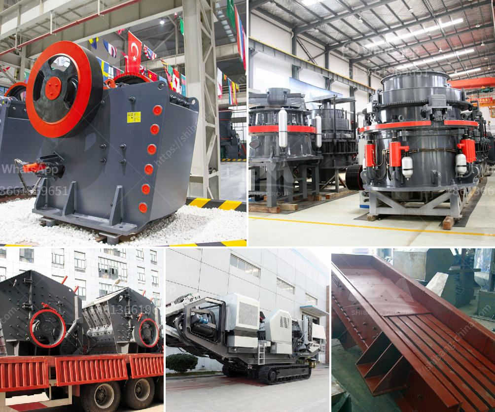

<h3>ball mill grinding media work</h3>
Ball mill is a necessary equipment for mixing and fine grinding of powders in various industries. It operates through the use of grinding media, which are balls of different sizes and made of various materials, including steel, ceramic and glass. The grinding media are created to cause impact and friction between the balls and the material being ground, thus reducing particle size and ultimately achieving a desired product quality and fineness.

The effectiveness of ball mill grinding media has a significant impact on the efficiency and performance of the whole grinding process. However, it is essential to choose suitable grinding media for a particular application to ensure optimal operation and reduce costs.

One important factor to consider when selecting grinding media is their composition, which should be carefully chosen based on the characteristics of the material being ground. For example, steel grinding media are commonly used for grinding ores and minerals due to their high hardness and wear resistance. Ceramic grinding media, on the other hand, are often used for grinding materials like ceramics, cement, pigments and others that require a contamination-free grinding environment. Glass grinding media are used in industries like pharmaceuticals and food, as they are chemically inert and do not react with the material being ground.

The size of the grinding media is another key parameter to consider. Larger media are typically used for coarse grinding or for breaking down larger particles, while smaller media are used for finer grinding and achieving a higher degree of product fineness. It is important to note that the optimal size of grinding media also depends on the specific requirements of the material and the desired product size distribution.

In addition to the composition and size, the density and shape of the grinding media can also impact the grinding efficiency. High-density media may provide better grinding performance due to increased impact and shear forces, while spherical or rounded media can enhance grinding efficiency by reducing the contact area and preventing excessive wear.

The selection of grinding media also includes considering the cost. Grinding media are consumables and can represent a significant portion of the overall operating expenses. Therefore, it is important to choose grinding media that provide the best performance and durability while being cost-effective. It is also worth mentioning that reusing or recycling worn-out media can help reduce costs and minimize waste.

In conclusion, ball mill grinding media play a crucial role in the efficiency and performance of the grinding process. The proper selection of grinding media, taking into account various factors such as composition, size, density, and shape, can optimize grinding performance and reduce costs. Careful consideration should be given to the specific requirements of the material being ground to ensure the best results.
<h3>Contact us</h3><ul><li><strong>Whatsapp:&nbsp;<a href="https://wa.me/8613661969651">+8613661969651</a></strong></li><li><a href="https://swt.shibang-china.com/?git&amp;zhl&amp;ball mill grinding media work"><strong>Online Service(chat now)</strong></a></li></ul><h3>Related</h3><ul><li><a href='clay vibrating screen.md'>clay vibrating screen</a></li><li><a href='gypsum factory in pakistan.md'>gypsum factory in pakistan</a></li><li><a href='price list of sand manufacturing machine india.md'>price list of sand manufacturing machine india</a></li><li><a href='graphite processing machine.md'>graphite processing machine</a></li><li><a href='project proposal on funding gold mining.md'>project proposal on funding gold mining</a></li></ul>