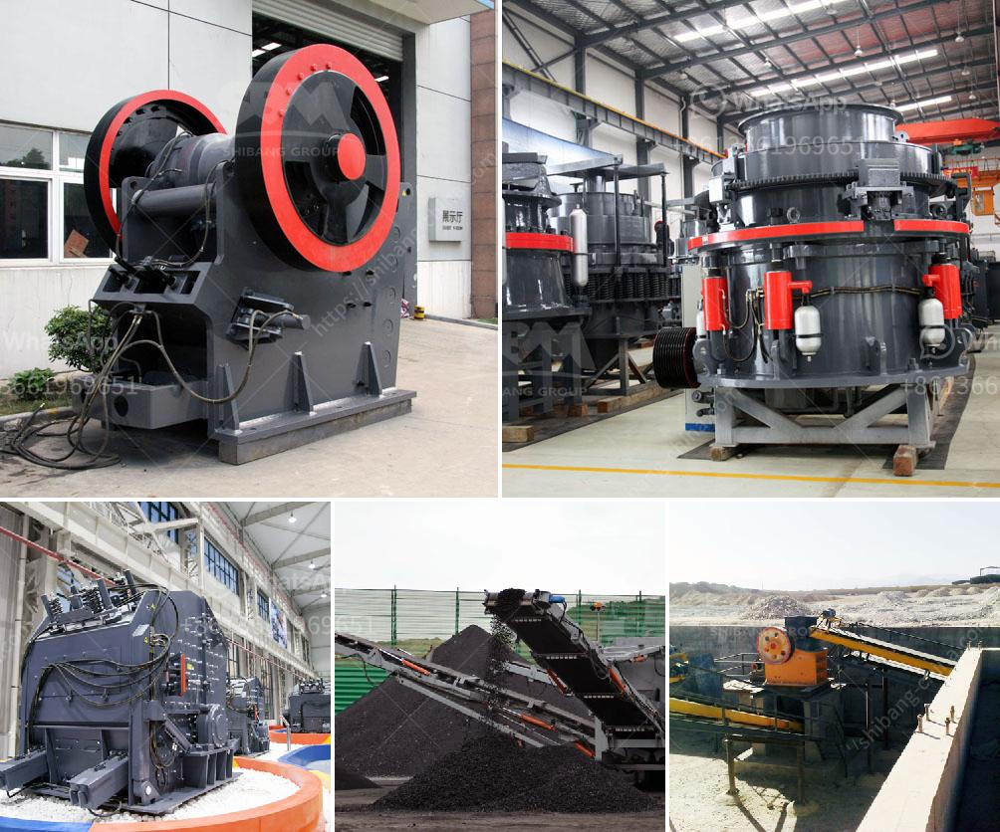

<h3>ball mill grinding rotate</h3>
Ball mill grinding is an essential process in many industries, such as the mining, metallurgical, cement, and chemical industries. It consists of a rotating hollow cylinder, usually filled with grinding media, which is the balls or rods, material to be ground, and water or other liquid. 

The rotation of the ball mill cylinder results in cascading and grinding of the materials as they are continuously lifted and dropped. This grinding action ensures that the material is finely ground to the desired particle size. The speed at which the ball mill rotates is significant as it directly influences the grinding efficiency.

In general, a higher rotation speed leads to more effective grinding. However, there is an optimum rotation speed that balances the grinding efficiency and the wear on the grinding media. Going beyond this optimum speed may result in excessive wear and inefficient grinding. Therefore, it is crucial to maintain the rotation speed within the recommended range for optimal performance.

The rotation speed of a ball mill can be controlled through several means. The most common method is by adjusting the power of the driving motor. Increasing or decreasing the motor power alters the rotation speed of the mill. Another method is by adding a variable frequency drive (VFD) to the motor. A VFD allows precise control of the rotation speed, enabling fine-tuning for optimal grinding performance.

The advantages of an optimal rotation speed are numerous. Firstly, it ensures that the materials are thoroughly ground, resulting in a finer particle size distribution. This is especially important in industries where achieving a specific particle size is crucial, such as in the production of cement or mineral concentrates.

Secondly, a higher rotation speed improves the grinding efficiency, reducing the grinding time and energy consumption. The shorter grinding time translates into higher productivity and cost savings. Additionally, a more efficient grinding process contributes to better control over the final product quality.

Thirdly, maintaining an optimal rotation speed minimizes wear and tear on the grinding media. Excessive rotation speed can lead to increased friction and impact, causing premature wear on the balls or rods. This can result in higher maintenance costs and reduced overall equipment lifespan.

In conclusion, ball mill grinding is a critical process in various industries. The rotation speed of the ball mill cylinder plays a significant role in the grinding efficiency, product quality, and equipment lifespan. It is essential to carefully determine and maintain the optimal rotation speed to achieve the desired grinding results while minimizing wear and maximizing productivity. By understanding the impact of rotation speed, industries can optimize their ball mill grinding processes, leading to improved operational efficiency and product quality.
<h3>Contact us</h3><ul><li><strong>Whatsapp:&nbsp;<a href="https://wa.me/8613661969651">+8613661969651</a></strong></li><li><a href="https://swt.shibang-china.com/?git&amp;zhl&amp;ball mill grinding rotate"><strong>Online Service(chat now)</strong></a></li></ul><h3>Related</h3><ul><li><a href='bauxite beneficiation plant.md'>bauxite beneficiation plant</a></li><li><a href='capacity of hammer mills used in kenya.md'>capacity of hammer mills used in kenya</a></li><li><a href='ball mill for silica sand.md'>ball mill for silica sand</a></li><li><a href='sale of ball mills used in peru.md'>sale of ball mills used in peru</a></li><li><a href='cement plant equipment catalogue pdf.md'>cement plant equipment catalogue pdf</a></li></ul>