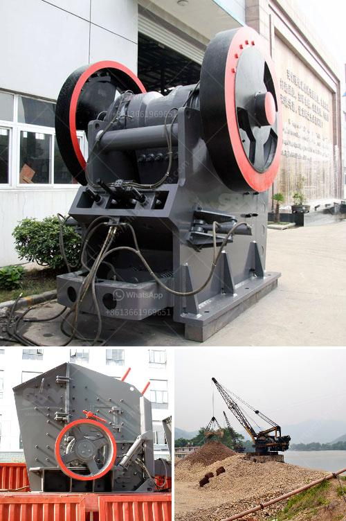

<h3>ball mill in copper plant</h3>
A ball mill is an indispensable tool when it comes to the crushing and grinding of materials like copper ore. It is capable of grinding various ores and other materials into fine powder. Ball mills are widely used in various industrial sectors such as cement, silicate products, new building materials, refractory materials, fertilizers, ferrous and non-ferrous metals, glass ceramics, and others. 

In a copper plant, a ball mill is used to grind bulk minerals such as copper ore, gold ore, magnetite ore, quartz, lead-zinc ore, feldspar, and other materials. After crushing process, the copper ore is sent to ball mill for grinding. Inside the ball mill, the crushed copper ore will grind the ore to about 0.2 mm with 3-inch steel balls. This copper ore slurry is finally pumped to the flotation deck for further flotation separation. 

The ball mill plays a crucial role in grinding and separating copper ore from waste rock. Initially, the ore is crushed into a fine powder to facilitate the separation of valuable minerals from waste rock. The crushed ore is then sent to a ball mill, where rotating steel balls grind the ore to a fine powder. The ore powder is then separated from waste rock using flotation cells. 

The ball mill used in the copper plant operates continuously, with around-the-clock grinding and separating duties. This continuous operation is necessary to maintain the desired copper concentration in the final product. Moreover, the ball mill must be able to process large amounts of ore efficiently to meet production targets. 

One of the key components of the ball mill is the grinding media, which are steel balls. These balls are responsible for the constant grinding and crushing of the ore. The selection of the right grinding media is crucial for optimal grinding performance. Factors such as ball size, material composition, and hardness must be carefully considered to ensure efficient operation. 

Additionally, the ball mill is equipped with a motor that drives the rotation of the mill. This motor provides the necessary energy for the grinding process. The motor and the ball mill are connected through a shaft, which transfers the rotational motion to the mill. The ball mill also features a voltage control system, which ensures stable operation and prevents damage to the motor. 

In conclusion, the ball mill is an essential tool in the copper plant for grinding and separating copper ore from waste rock. It plays a vital role in facilitating the flotation process and achieving the desired copper concentration in the final product. The proper selection of grinding media and efficient motor operation are critical factors for the success of the ball mill in the copper plant.
<h3>Contact us</h3><ul><li><strong>Whatsapp:&nbsp;<a href="https://wa.me/8613661969651">+8613661969651</a></strong></li><li><a href="https://swt.shibang-china.com/?git&amp;zhl&amp;ball mill in copper plant"><strong>Online Service(chat now)</strong></a></li></ul><h3>Related</h3><ul><li><a href='list of compartment of gypsum crusher plant.md'>list of compartment of gypsum crusher plant</a></li><li><a href='want to lease diamond mining equipment in south africa.md'>want to lease diamond mining equipment in south africa</a></li><li><a href='washing plant setup cost south africa.md'>washing plant setup cost south africa</a></li><li><a href='gravel gravel and sand mining equipment.md'>gravel gravel and sand mining equipment</a></li><li><a href='quarry aggregate manufacturing process ppt.md'>quarry aggregate manufacturing process ppt</a></li></ul>