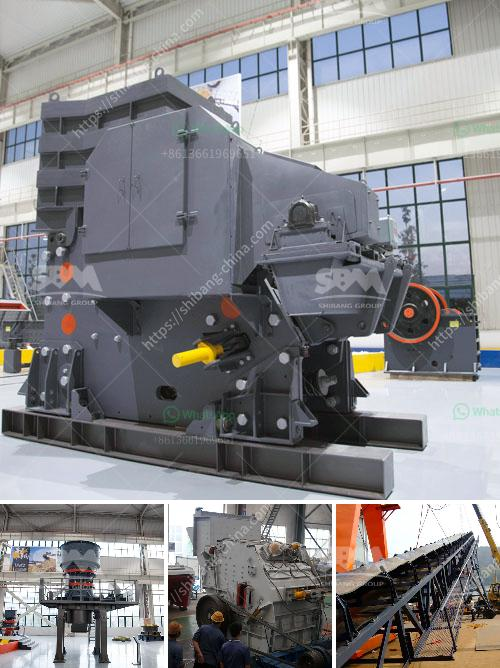

<h3>ball mill in romania italy</h3>
The term "ball mill" refers to a type of grinding mill equipment used in the industrial sector that extensively uses steel balls to crush materials into a fine powder. They are cylindrical devices with a diameter ranging from 10 centimeters to several meters. These mills can grind materials of various sizes, right from small particles to large-sized objects. It is widely utilized in diverse industries including mining, construction, cement, metallurgy, and more.

Romania, located in Southeast Europe, is known for its rich history and beautiful landscapes. Over the years, the country has seen significant growth in its industrial sector, with a particular focus on mining and construction. The ball mill, being an essential part of these industries, can serve as a valuable tool for Romania's economic development.

One prominent example of a ball mill in Romania can be found in its capital city, Bucharest. Built in the late 1960s, this ball mill is used in cement production where clinker is grounded with limestone. The mill has a capacity of producing nearly 100,000 tons of cement annually, making it one of the largest ball mills in the country. It plays a crucial role in the manufacturing process of cement by providing the necessary fineness of the raw material mix.

Another notable example of ball mills can be found in Italy, a country renowned for its rich cultural heritage and contributions to various industries. Italy has a well-established mining industry, and ball mills are widely used in the mining sector, particularly in the extraction of copper, gold, and other precious metals. One such application is the refining of ore extracted from underground mines. The ore is first crushed using ball mills, and then further processed to separate the valuable minerals from the waste.

In recent years, there has been an increasing trend towards the use of energy-efficient ball mills for sustainable development. These mills are designed with enhanced features such as adjustable speed and optimized milling conditions, resulting in reduced power consumption and improved grinding efficiency. In both Romania and Italy, the adoption of such advanced ball mill technologies has been instrumental in minimizing energy costs and maximizing productivity.

Furthermore, the maintenance and proper operation of ball mills are critical to ensure their longevity and optimal performance. Regular inspections, lubrication, and repairs are key aspects of maintenance practices in Romania and Italy, ensuring that the mills operate efficiently and effectively.

In conclusion, ball mills play a crucial role in various industries in both Romania and Italy. Their applications range from cement production to mining of valuable minerals. The adoption of energy-efficient technologies and proper maintenance practices contributes to the sustainable development of these countries, ensuring economic growth and environmental protection. As these industries continue to evolve, ball mills will remain an indispensable tool, providing the groundwork for the manufacturing processes that drive the respective economies forward.
<h3>Contact us</h3><ul><li><strong>Whatsapp:&nbsp;<a href="https://wa.me/8613661969651">+8613661969651</a></strong></li><li><a href="https://swt.shibang-china.com/?git&amp;zhl&amp;ball mill in romania italy"><strong>Online Service(chat now)</strong></a></li></ul><h3>Related</h3><ul><li><a href='ball mill plant manufacturers.md'>ball mill plant manufacturers</a></li><li><a href='vibrating screen feeder.md'>vibrating screen feeder</a></li><li><a href='aggregate crushing plant sale.md'>aggregate crushing plant sale</a></li><li><a href='ball mill feldspar 200 mesh output.md'>ball mill feldspar 200 mesh output</a></li><li><a href='bentonite processing plant in maharashtra.md'>bentonite processing plant in maharashtra</a></li></ul>