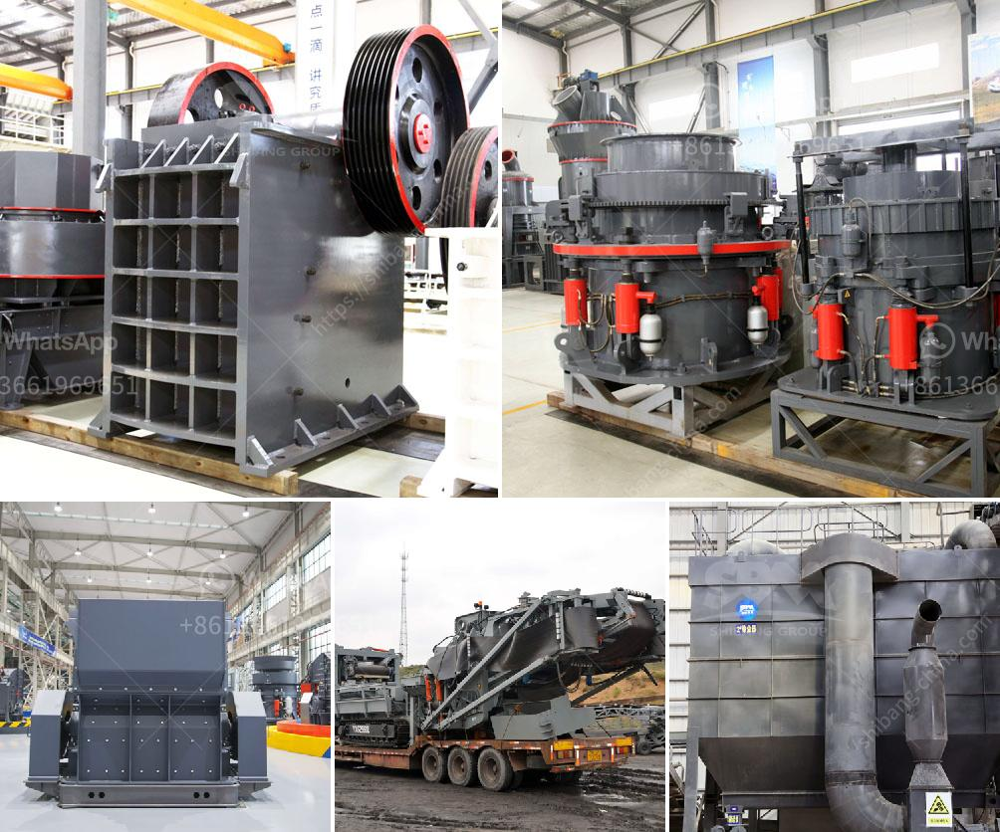

<h3>ball mill italia</h3>
Ball mill Italia is a company composed of experts with a passion for materials technology in a wide range of sectors, in particular the mechanical processing of natural stone such as marble, granite, porphyry, and travertine. They specialize in the creation of machinery capable of handling and processing these materials with precision and efficiency.

One of the key products offered by Ball mill Italia is their highly efficient and functional ball mill, a device that is used to crush chemicals and reduce the particle size of the materials. This ball mill has a compact design and is made with high-quality materials that ensure its long-lasting performance. It also features advanced technology that improves its efficiency, making it popular among various industries.

What sets Ball mill Italia apart from its competitors is their commitment to quality and customer satisfaction. They understand that each client has unique requirements and they strive to provide tailored solutions that meet and exceed these expectations. They work closely with their clients, ensuring that the equipment is designed and manufactured to their exact specifications.

Furthermore, Ball mill Italia puts a strong emphasis on innovation and continuous improvement. They invest in research and development to stay ahead of the competition and to offer the latest technological advancements in their products. This commitment to innovation has earned them a reputation as a leading manufacturer in the industry.

In addition to their exceptional products, Ball mill Italia also provides comprehensive after-sales support. Their team of highly skilled technicians is available to provide assistance and expertise whenever needed. This dedication to customer service has fostered long-lasting relationships with clients, who trust Ball mill Italia for all their milling needs.

In conclusion, Ball mill Italia is a reputable company with a strong focus on quality, innovation, and customer satisfaction. Their ball mill and other machinery are highly regarded in the industry for their efficiency and reliability. Whether it's natural stone processing or chemical crushing, Ball mill Italia has the expertise and equipment to meet the requirements of clients in various sectors.
<h3>Contact us</h3><ul><li><strong>Whatsapp:&nbsp;<a href="https://wa.me/8613661969651">+8613661969651</a></strong></li><li><a href="https://swt.shibang-china.com/?git&amp;zhl&amp;ball mill italia"><strong>Online Service(chat now)</strong></a></li></ul><h3>Related</h3><ul><li><a href='cost of limestone crusher plant.md'>cost of limestone crusher plant</a></li><li><a href='milling grinding machines manufacturer europe.md'>milling grinding machines manufacturer europe</a></li><li><a href='mica powder machine.md'>mica powder machine</a></li><li><a href='gravel crusher equipment.md'>gravel crusher equipment</a></li><li><a href='stone crushing turkey.md'>stone crushing turkey</a></li></ul>