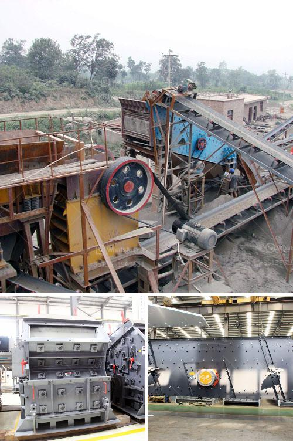

<h3>ball mill machine india</h3>
India is a country famous for its rich culture, heritage, and diversity. Over the years, it has also emerged as a prominent player in the manufacturing industry. One of the essential manufacturing machines in India is the ball mill machine. As the name suggests, it is used to grind different types of materials into fine powder, primarily for use in various industries like construction, ceramics, paint, pharmaceuticals, and more.

The ball mill machine in India is manufactured based on advanced grinding technology, which enables it to successfully grind materials into a fine powder. With various industrial applications, this machine is widely used in the Indian manufacturing sector. The ball grinding machine can process a wide range of materials, ranging from minerals to cement, ceramics, and even construction materials.

The ball mill machine in India has been hugely successful, especially in recent years. It has been instrumental in the growth of the manufacturing industry, with its ability to grind materials efficiently. This machine is not only cost-effective but also environmentally friendly, as it reduces waste and decreases energy consumption.

Additionally, the ball mill machine in India is highly versatile, allowing manufacturers to produce different types of products according to market demand. With its ability to produce precise and consistent results, it has become an indispensable tool in many industries. Not only does it enhance productivity, but it also ensures high-quality end products.

The ball mill machine in India is undoubtedly a must-have manufacturing machine. Its widespread use across different industries is a testament to its efficiency and reliability. Manufacturers and businesses across the country continue to embrace this machine as it helps them stay competitive and meet market demands.

With continuous advancements in technology, the ball mill machine in India is expected to witness further enhancements. These may include increased automation, improved energy efficiency, and better overall performance. As India continues to strive towards becoming a global manufacturing hub, the ball mill machine will play a crucial role in achieving this goal.
<h3>Contact us</h3><ul><li><strong>Whatsapp:&nbsp;<a href="https://wa.me/8613661969651">+8613661969651</a></strong></li><li><a href="https://swt.shibang-china.com/?git&amp;zhl&amp;ball mill machine india"><strong>Online Service(chat now)</strong></a></li></ul><h3>Related</h3><ul><li><a href='project proposal on funding gold mining.md'>project proposal on funding gold mining</a></li><li><a href='fully mobile limestone crusher.md'>fully mobile limestone crusher</a></li><li><a href='coal grinding mill in india.md'>coal grinding mill in india</a></li><li><a href='prices of hammer mill in zimbabwe.md'>prices of hammer mill in zimbabwe</a></li><li><a href='granite crushers in germany.md'>granite crushers in germany</a></li></ul>