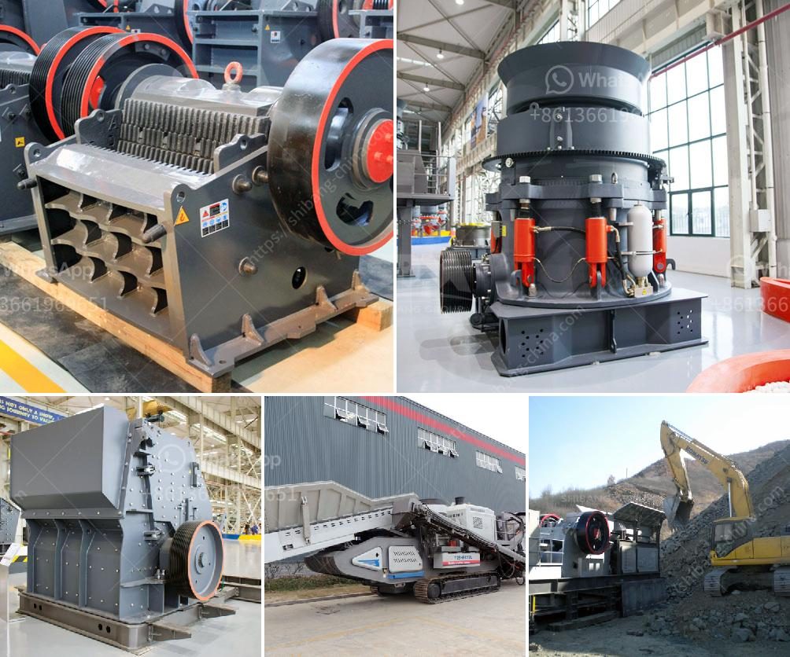

<h3>ball mill manufacturer in bhayander</h3>
Ball mills are devices used to crush and grind materials into fine powders. They are highly efficient, as they can perform a variety of tasks at a lower cost than other types of mills. This is why ball mills are a crucial part of the manufacturing process in many industries, including pharmaceuticals, metal and mineral processing, and paints and coatings.

When it comes to sourcing a ball mill, it is essential to find a reliable and reputable manufacturer. One such manufacturer in Bhayander, a suburb of Mumbai, India, is known for their high-quality ball mills and superior customer service.

This manufacturer has been in the industry for several years and has built a solid reputation for producing top-notch equipment that meets various industrial needs. Their ball mills are designed with precision and expertise, ensuring optimal performance and longevity.

One of the factors that set this manufacturer apart from others is their dedication to customer satisfaction. They understand the significance of providing prompt and effective customer support, as well as offering customization options to meet specific requirements. Whether clients need assistance in selecting the right ball mill for their application or need guidance on installation and maintenance, this manufacturer goes the extra mile to ensure their customers are satisfied.

In addition to their commitment to customer service, this manufacturer also prioritizes quality. They use the finest materials and employ highly skilled engineers and technicians to manufacture their ball mills. This attention to detail ensures that their products are of the highest quality, delivering reliable performance and durability.

Furthermore, this manufacturer embraces innovation and continuously invests in research and development to enhance the capabilities of their ball mills. By staying at the forefront of technological advancements, they can offer cutting-edge, efficient, and environmentally friendly solutions.

Overall, if you are in need of a ball mill in Bhayander, look no further than this reputable manufacturer. With their high-quality products, exceptional customer service, and commitment to innovation, they are the ideal choice for industries seeking reliable and efficient ball mill solutions.
<h3>Contact us</h3><ul><li><strong>Whatsapp:&nbsp;<a href="https://wa.me/8613661969651">+8613661969651</a></strong></li><li><a href="https://swt.shibang-china.com/?git&amp;zhl&amp;ball mill manufacturer in bhayander"><strong>Online Service(chat now)</strong></a></li></ul><h3>Related</h3><ul><li><a href='working principle of conveyor belt.md'>working principle of conveyor belt</a></li><li><a href='stone crusher made in italy.md'>stone crusher made in italy</a></li><li><a href='used mining equipment for sale in ghana.md'>used mining equipment for sale in ghana</a></li><li><a href='crusher plant cost in pakistan.md'>crusher plant cost in pakistan</a></li><li><a href='ballast stone crusher in india.md'>ballast stone crusher in india</a></li></ul>