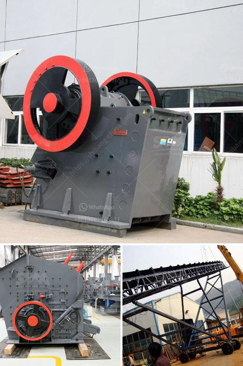

<h3>ball mill manufacturer in philippines</h3>
Philippines has a reputation for its high-quality ball mills launched by grinding mill manufacturer Mines and Geosciences Bureau. The initial idea behind constructing these mills was to provide high-quality metallic balls for grinding operations. However, these mills have also gained immense popularity among the people of Philippines. With the increase in demand for ball mills in the country, many manufacturing companies have started offering these mills to meet the growing needs. Here, we will discuss the top ball mill manufacturers in Philippines to give you a sense of what to expect when contacting different vendors for your grinding equipment needs.

First, let's take a look at the company that has been providing its services to the Philippines market since the 1980s, Fote Heavy Machinery Co., Ltd. This company offers quite an extensive range of products and services, including custom designed machinery, fabrication, and installation as well as machinery repair services. They have a team of experienced professionals who are dedicated to meeting customer requirements and ensuring the highest level of customer satisfaction. With their vast experience in the industry, Fote Heavy Machinery has become one of the most reliable manufacturers in the Philippines.

Another reputable manufacturer in the Philippines is Henan Hongxing Mining Machinery Co., Ltd. With over 35 years of manufacturing experience, they have developed a reputation for producing high-quality ball mills at reasonable prices. Their website showcases a wide range of ball mill models, catering to different grinding needs. Henan Hongxing Mining Machinery also provides additional services such as installation, commissioning, and maintenance to ensure that their customers' grinding operations run smoothly.

Meanwhile, Dragon Mining Equipment Ltd. is known for its durable and robust ball mills. They are committed to providing the best quality products that offer long-term reliability and efficiency. Dragon Mining Equipment's ball mills are designed with advanced technology, ensuring excellent performance and low maintenance. They also offer customized solutions to meet specific grinding requirements. With their extensive experience in the mining industry, Dragon Mining Equipment has become a trusted name in the Philippines.

Apart from these three manufacturers, there are numerous other ball mill manufacturers in the Philippines. They cater to a wide range of industries, including mining, construction, ceramics, glass, and more. Some of the leading suppliers in the country include ECOMAN, Henan Fote Heavy Machinery Co., Ltd., Promac Engineering Industries Limited, and Jiangxi Mingxin Metallurgy Equipment Co., Ltd.

In conclusion, the ball mill manufacturers in the Philippines are credible options if you want to seek durable and reliable grinding equipment for your mining site project. Look for manufacturers that have been in the industry for a long time and have a proven track record for delivering high-quality products. Additionally, consider the additional services offered, such as installation and maintenance support, to ensure smooth operations throughout the lifecycle of your ball mill.
<h3>Contact us</h3><ul><li><strong>Whatsapp:&nbsp;<a href="https://wa.me/8613661969651">+8613661969651</a></strong></li><li><a href="https://swt.shibang-china.com/?git&amp;zhl&amp;ball mill manufacturer in philippines"><strong>Online Service(chat now)</strong></a></li></ul><h3>Related</h3><ul><li><a href='rock crusher dust fog control system philippines.md'>rock crusher dust fog control system philippines</a></li><li><a href='rock crusher in kenya.md'>rock crusher in kenya</a></li><li><a href='harga stone crusher 400 x 600 harga stone crusher.md'>harga stone crusher 400 x 600 harga stone crusher</a></li><li><a href='pictures of copper ore mining nigeria.md'>pictures of copper ore mining nigeria</a></li><li><a href='stone crusher plant indonesia.md'>stone crusher plant indonesia</a></li></ul>