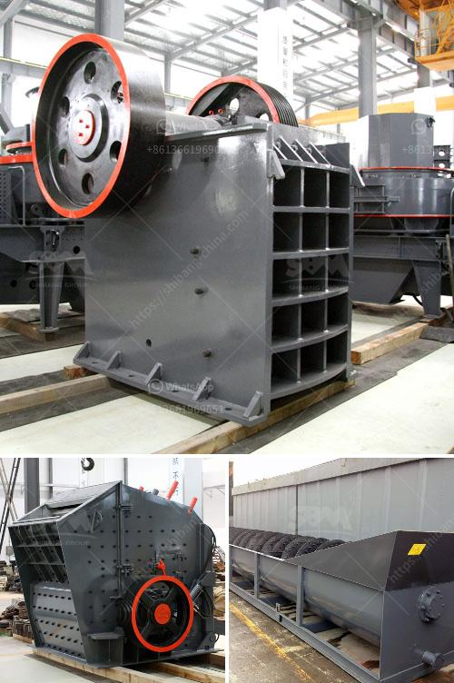

<h3>ball mill manufactures in zimbabwe</h3>
Ball mill manufactures in Zimbabwe are the leading manufacturers of ball mill equipment for the mining industry. They have a wide range of ball mill products available, including ceramic ball mills, rubber lining mills, ore processing mills, and even disc mill operations.

Their ball mill equipment is sophisticated and has the latest technology to deliver reliable and efficient results to their customers. These ball mill manufactures in Zimbabwe are well-established and have been in the industry for many years. They have a strong reputation for producing high-quality equipment and delivering exceptional customer service.

Ball mill manufactures in Zimbabwe are known for their excellent craftsmanship and attention to detail. They have a team of highly skilled engineers and technicians who oversee the entire manufacturing process. From the design stage to the final production, every step is carefully monitored to ensure the highest quality and performance standards are met.

The ball mill manufactures in Zimbabwe use top-notch materials to construct their products. These materials are chosen for their durability and long-lasting performance. The ball mill equipment is designed to withstand the rigorous conditions of the mining industry, ensuring it can handle the high demand and harsh conditions that come with mining operations in Zimbabwe.

One of the advantages of using ball mill manufactures in Zimbabwe is the wide range of products available. They offer ball mills in different sizes, allowing customers to find the right equipment for their specific needs. Whether it's for small-scale or large-scale operations, there is a ball mill available to meet the requirements.

In addition to offering a variety of ball mill sizes, these manufactures also provide different types of mills. For example, they offer ceramic ball mills that are specially designed for grinding materials and have a high level of hardness and heat resistance. They also have rubber lining mills that are ideal for processing ores and are known for their excellent wear and impact resistance.

The ball mill manufactures in Zimbabwe also offer disc mill operations for grinding even the toughest materials. The disc mill is a type of mill that grinds solid materials into smaller pieces by a rotating disc. It's commonly used in the mining industry to reduce ore particles to finer sizes for further processing.

Overall, ball mill manufactures in Zimbabwe are reliable and trusted sources for high-quality ball mill equipment. They have a proven track record in the industry and continue to innovate and improve their products to meet the changing needs of their customers. Whether it's for mining operations or other industrial applications, customers can rely on these manufactures to provide durable, efficient, and reliable ball mill equipment.
<h3>Contact us</h3><ul><li><strong>Whatsapp:&nbsp;<a href="https://wa.me/8613661969651">+8613661969651</a></strong></li><li><a href="https://swt.shibang-china.com/?git&amp;zhl&amp;ball mill manufactures in zimbabwe"><strong>Online Service(chat now)</strong></a></li></ul><h3>Related</h3><ul><li><a href='ball mills in vizag.md'>ball mills in vizag</a></li><li><a href='price quarry stone crusher.md'>price quarry stone crusher</a></li><li><a href='stone crushing process.md'>stone crushing process</a></li><li><a href='wet grinding mill.md'>wet grinding mill</a></li><li><a href='terrex stone crushers in usa.md'>terrex stone crushers in usa</a></li></ul>