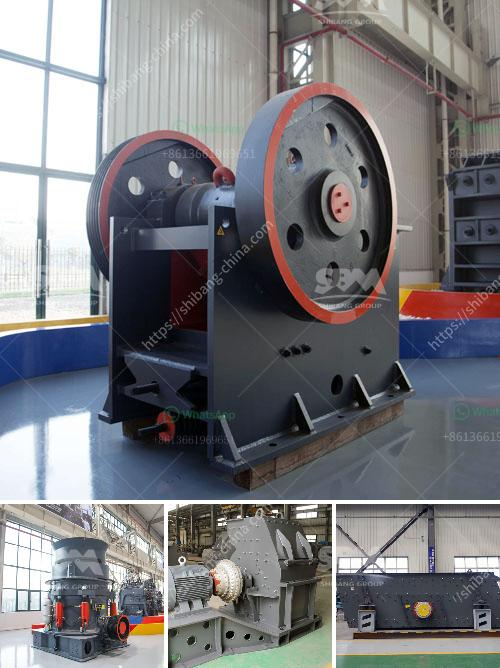

<h3>ball mill operating rpm calculation</h3>
A ball mill is a grinder used to grind materials into fine powder. It is a cylindrical device rotating around its axis and performing a grinding action by the balls inside it. For efficient grinding, a ball mill must be operated at a proper speed called the critical speed.

The critical speed of a ball mill is the speed at which the balls just begin to centrifuge along the wall of the cylinder. This happens when the centrifugal force equals the force of gravity acting on them. At this speed, the grinding media layer is pushed to the outermost part of the mill, creating a cascading effect and ensuring maximum grinding efficiency.

To calculate the critical speed of a ball mill, one needs to know the diameter and length of the mill, the type of material being ground, and the rotational speed. The formula for calculating the critical speed is:

For example, let's assume a ball mill with a diameter of 2 meters and ball diameter of 0.1 meters. Plugging these values into the formula:

The operating speed of the ball mill must be maintained below the critical speed to avoid excessive wear and reduce the chances of damage to the mill. However, the ideal speed range may vary depending on the specific characteristics of the material being ground.

Appropriate operating speed ensures proper grinding action and uniform particle size distribution. Operating below the critical speed results in ineffective grinding, while operating above the critical speed can cause the particles to be thrown against the lining, leading to increased wear and heat generation.

In a ball mill, the rotational speed is usually specified as a percentage of the critical speed. This percentage is called the mill speed ratio and is expressed as a decimal fraction. It is calculated by dividing the actual mill speed by the critical speed:

Considering the critical speed of 9.16 RPM obtained earlier, let's assume an operating speed of 70% of the critical speed:

Proper operating speed ensures that the balls inside the mill cascade rather than cataract, ensuring efficient grinding action. Additionally, it helps to maintain the mill's structural integrity by preventing excessive vibrations and minimizing the chances of mechanical failure.

In conclusion, calculating the operating speed of a ball mill is crucial for its efficient and effective operation. The critical speed must be determined using the mill diameter, ball diameter, and the type of material being ground. The operating speed should then be maintained below this critical speed to achieve optimal grinding and avoid excessive wear and damage to the mill.
<h3>Contact us</h3><ul><li><strong>Whatsapp:&nbsp;<a href="https://wa.me/8613661969651">+8613661969651</a></strong></li><li><a href="https://swt.shibang-china.com/?git&amp;zhl&amp;ball mill operating rpm calculation"><strong>Online Service(chat now)</strong></a></li></ul><h3>Related</h3><ul><li><a href='for sale rock crushing tons.md'>for sale rock crushing tons</a></li><li><a href='types coal ball mill.md'>types coal ball mill</a></li><li><a href='crushing plant and equipment.md'>crushing plant and equipment</a></li><li><a href='project proposal about grinding milling company.md'>project proposal about grinding milling company</a></li><li><a href='stone crusher machine for sale in kenya.md'>stone crusher machine for sale in kenya</a></li></ul>