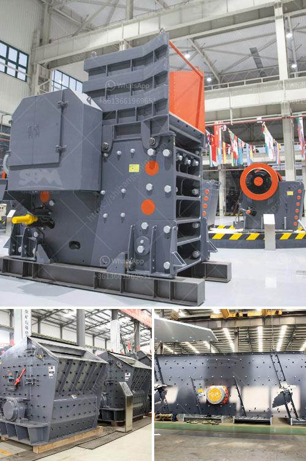

<h3>ball mill plant manufacturers</h3>
The ball mill plant manufacturers are commonly known as mining equipment suppliers in the mining industry. Located in different countries, they manufacture equipment for grinding stones, rocks and minerals into fine powder. The global ball mill plant manufacturers are impressive in their abilities to manufacture durable as well as reliable products. 

Ball mill plants are used to grind various materials into different industries. The mining industry commonly uses various types of ball mills, including overflow ball mills, grid ball mills, and rod mills. As the technical expertise of the concerned manufacturers attains new heights, improvements are witnessed in the construction of these machines. 

One of the leading ball mill plant manufacturers, Hongxing Mining Machinery Co. Ltd has more than 50 years of experience in manufacturing various types of ball mills. They have been instrumental in developing grinding mills for mining applications, cement production, coal preparation, and metallurgical industries. The company is known for its high-quality products and exceptional customer service. 

Another reputed manufacturer, Metso Outotec, has years of expertise in designing and manufacturing ball mills for various applications. Their ball mills are widely used by mining companies, cement manufacturers, and other industrial sectors. Their equipment is known for its durability, high performance, and low maintenance requirements. Metso Outotec provides complete solutions for customers, including installation, commissioning, and after-sales service. 

The ball mill plant manufacturers continue to invest in research and development to enhance the existing features of their products. They focus on improving the efficiency, reliability, and energy-saving capabilities of their equipment. Through continuous innovation, the manufacturers aim to provide better solutions to the mining industry and cater to the evolving needs of their customers. 

Advancements in technology have also contributed to the development of ball mill plants. Digitalization and automation are becoming increasingly common in the mining industry. Manufacturers are incorporating these technologies into their equipment to improve control and monitoring capabilities. This allows operators to optimize the grinding process and improve overall productivity. 

In order to meet the varied requirements of different industries, the manufacturers offer customized solutions. They collaborate closely with their clients to understand their specific needs and design equipment accordingly. The ball mill plant manufacturers strive to provide cost-effective solutions without compromising on quality. 

As environmental concerns gain importance worldwide, the manufacturers are also focusing on developing environmentally friendly solutions. They are exploring ways to reduce energy consumption, minimize emissions, and utilize sustainable materials. These initiatives not only benefit the environment but also help their clients meet regulatory requirements. 

In conclusion, the ball mill plant manufacturers play a crucial role in the mining industry. With their expertise and technological advancements, they provide reliable, durable, and efficient grinding solutions. They continue to invest in research and development to enhance their products, meet the evolving needs of their customers, and promote sustainability. Whether it's for mining, cement production, or other industries, the ball mill plant manufacturers are dedicated to offering customized, cost-effective, and environmentally friendly solutions.
<h3>Contact us</h3><ul><li><strong>Whatsapp:&nbsp;<a href="https://wa.me/8613661969651">+8613661969651</a></strong></li><li><a href="https://swt.shibang-china.com/?git&amp;zhl&amp;ball mill plant manufacturers"><strong>Online Service(chat now)</strong></a></li></ul><h3>Related</h3><ul><li><a href='fully mobile limestone crusher.md'>fully mobile limestone crusher</a></li><li><a href='barite beneficiation plant manufacturers in usa.md'>barite beneficiation plant manufacturers in usa</a></li><li><a href='tonne stone crusher cost sale.md'>tonne stone crusher cost sale</a></li><li><a href='hammer mill grinder thailand.md'>hammer mill grinder thailand</a></li><li><a href='quarry crusher for sale in nigeria.md'>quarry crusher for sale in nigeria</a></li></ul>