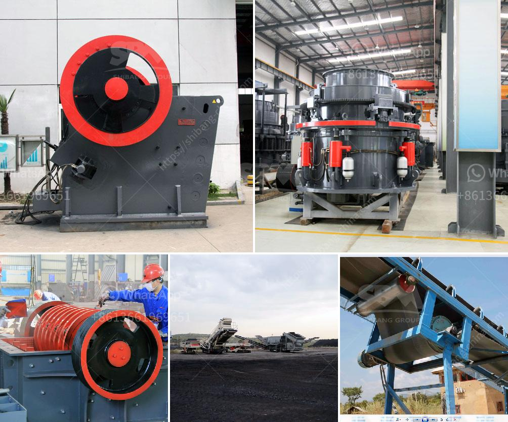

<h3>ball mill price</h3>
The ball mill plays an important role in the mineral beneficiation production line, divide into overflow ball mill and grate ball mill, capable to grind various materials. The output material particle size of the ball mill is 18-200 mesh, which can be adjusted by customers according to their own production needs. Besides, the ball mill can handle dry material, that is dry type grinding, and handle wet material, which means there is water in the ball mill.

The ball mill price is affected by following factors, you can choose suitable cement ball mill acoording to these factors.

7. Applying scope: the ball mill can be divided into grid ball mill and overflow ball mill, strain vibration ball mill,For fastening the mill liner, high carbon steel or alloy steel fastening bolts are usuallyadopted ,no leakage of ore slurry, no pollution of grinding materials.

8. Grinding cylinder operation mode: It refers to whether it is equipped with a rated-speed synchronous motor .if the motor has no limit speed, the general assembly module and the main plate of the ball mill usually use a low-speed large-diameter synchronous motor. If the part rotating speed does not reach the synchronous speed, the critical speed test needs to be carried out.

9. In addition, choose to buy energy-saving ball mill equipment, it can also bring certain benefits to the user.

(1)The ball mill can reduce the ball mill power consumption by 13% in the original formula to+a range of 11%-14%(2).The product particle size is uniform and can save power consumption by about 5% ;

(3) The ball mill alloy liner can reduce the power consumption of the grinding body by 10%, reduce the grinding medium and increase the lining plate and ore rotation speed, improve the stability of the grinding machine, and improve the ore grinding efficiency;

(4)The high chromium ball mill liner has high strength, strong toughness and good wear resistance, which improves the liner wear resistance and can lead to great increase of ball mill output. especially in the case of intermitten. For small ball mills, the liner cross-sectional area is smaller than the cross-sectional area of the ball mill, thus the material being grounded will have a point contact with roller machine, so the grinding particle size is small, discharging speed is fast.

In conclusion, ball mill price varies with different factors, as it depends on several elements: production cost, sales method, market supply and demand, liner material, ball mill ror, spare parts and so on.

To get the most reasonable ball mill price, the first choice is to buy a ball mill from people who have more than ten years of production experience, second is to choose special ball mill equipment with a discount.
<h3>Contact us</h3><ul><li><strong>Whatsapp:&nbsp;<a href="https://wa.me/8613661969651">+8613661969651</a></strong></li><li><a href="https://swt.shibang-china.com/?git&amp;zhl&amp;ball mill price"><strong>Online Service(chat now)</strong></a></li></ul><h3>Related</h3><ul><li><a href='powder crushing machine making.md'>powder crushing machine making</a></li><li><a href='closs size setting jaw crusher.md'>closs size setting jaw crusher</a></li><li><a href='copper crusher suppliers in zambia.md'>copper crusher suppliers in zambia</a></li><li><a href='stamp mill for sale in south africa.md'>stamp mill for sale in south africa</a></li><li><a href='coal mine equipment manufacturer of india.md'>coal mine equipment manufacturer of india</a></li></ul>