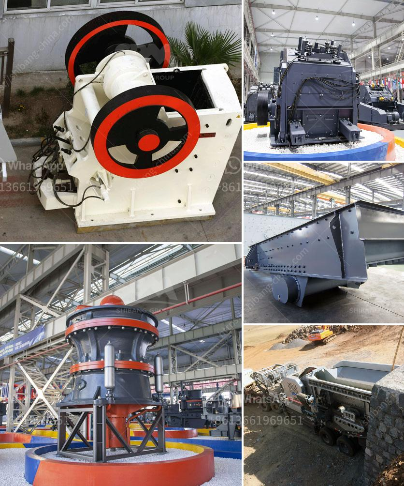

<h3>ball mill problems and solutions</h3>
Ball mill is a kind of commonly used grinding equipment in beneficiation plant and cement production plant. Like all the machines, there might be problems in the work process of ball mill. In this article, we mainly introduce frequent problems and solutions in ball mill work process.

Solution: in the work process of ball mill, if there is frequent and loud clack sound in ball mill, it may be because the screw bolts loosen. To solve this problem, operators should found out the loosen screw bolts and tighten them.

Solution: Check the lubrication points in ball mill and make sure the lubricating oil meets requirements. Operators should also check the temperature of bearings after running for one hour. If the temperature is too high, operators should immediately stop the ball mill and check the ball mill to ensure its normal operation.

Solution: operators should check the lubrication condition of the reducer's main bearing and find out if the lubrication oil is clean and well-lubricated. If the lubricating oil is dirty or less lubricating, operators should clean the lubrication system, remove debris, and replace the lubricating oil regularly.

Solution: operators should check if there is any loose screw bolts inside the motor flange and tighten them in time. In addition, the motor bearing and gear shaft should be checked for leakage and damage. If there is any problem, it should be solved in time.

Solution: operators should inspect and check the motor and other parts to ensure everything is functioning smoothly. If there is a problem, it should be dealt with in a timely manner.

Solution: operators should first check if there is any obvious oil leakage. If there is, operators should stop the ball mill and deal with it immediately. If there is no oil leakage, then we can judge the specific problem based on the specific situation. Commonly, there may be four reasons: insufficient oil supply; excessive oil supply; the lubrication oil is dirty or the viscosity is too high; and the bearing clearance is too small or too large.

In conclusion, it is important to carry out regular maintenance and repair work on ball mill. Problems can be spotted early, and solutions can be provided promptly, preventing the unexpected occurrence of larger malfunctions. By doing so, the ball mill will function well for the whole beneficiation plants and cement production plants.
<h3>Contact us</h3><ul><li><strong>Whatsapp:&nbsp;<a href="https://wa.me/8613661969651">+8613661969651</a></strong></li><li><a href="https://swt.shibang-china.com/?git&amp;zhl&amp;ball mill problems and solutions"><strong>Online Service(chat now)</strong></a></li></ul><h3>Related</h3><ul><li><a href='project plan about stone crashing machine.md'>project plan about stone crashing machine</a></li><li><a href='fly ash grinding machine manufacturar in india.md'>fly ash grinding machine manufacturar in india</a></li><li><a href='stone crusher machine in south africa.md'>stone crusher machine in south africa</a></li><li><a href='quartz ball milling machinery.md'>quartz ball milling machinery</a></li><li><a href='stone crusher machine for sale ethiopia.md'>stone crusher machine for sale ethiopia</a></li></ul>