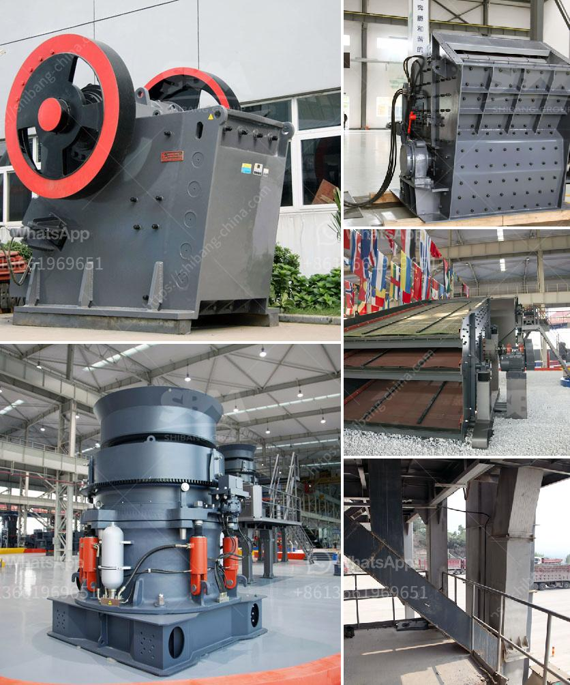

<h3>ball mill shell materials</h3>
A ball mill is a type of grinding mill that is used to grind materials into fine powder. Ball mills are cylindrical in shape and are often the grinder of choice when it comes to mashing paints, ores, ceramic materials, and certain hard chemicals.

By rotating on a horizontal axis, a ball mill can effectively convert a hard material into a loose powder. In addition to the material that is meant to be ground, ball mills also contain a grinding material. Ceramic balls, stainless steel balls, and flint pieces are often used as grinding materials.

When this matter grinds against another matter, the result is a crushed powder that can then be used for other applications. An industrially wide-used material, ball mills are a great solution for any Crushing needs.

Rubber, plastic or polyurethane-lined plate, high manganese steel plate, high alumina ceramic plate, ceramic composite materials, casting and other materials wear and long life. In many grinding applications, the wear and impact resistance properties of low alloy steel balls have been widely recognized, especially cast low alloy steel balls. In the dry grinding process, the wear of steel ball is not only influenced by the impact force but also by the abrasive wear.

Preventive measures such as coatings and countermeasures for reducing wear of ball mill have been studied for many years. It has been found that the wear resistance of solid materials is closely related to its crystal structure, crystal shape, and the hardness of its chemical composition. Therefore, to improve the wear resistance of ball mill, appropriate material should be selected. Fabrication of ball mill shell from quality-tested metals ensures durability and longevity. Moreover, it is important to ensure that the material is resistant to corrosion and can withstand high temperature and pressure.

In conclusion, ball mills are a valuable tool for the grinding and crushing of materials, with a wide range of applications. The grinding material used in the ball mill is usually steel balls, but there are also other materials such as ceramics, rubber, and polyurethane lining plates. In addition, high-manganese steel plates, chromium-molybdenum alloy steel plates, and other materials are generally used for the lining plate of the ball mill, which can withstand high-temperature and high-pressure environments. When choosing materials for ball mill shells, it is crucial to consider their wear resistance, heat resistance, and corrosion resistance properties to ensure long life and optimal performance of the ball mill.
<h3>Contact us</h3><ul><li><strong>Whatsapp:&nbsp;<a href="https://wa.me/8613661969651">+8613661969651</a></strong></li><li><a href="https://swt.shibang-china.com/?git&amp;zhl&amp;ball mill shell materials"><strong>Online Service(chat now)</strong></a></li></ul><h3>Related</h3><ul><li><a href='vertical shaft impact crusher design.md'>vertical shaft impact crusher design</a></li><li><a href='limestone powder mill in bankura.md'>limestone powder mill in bankura</a></li><li><a href='manufacturers of conveyor belts.md'>manufacturers of conveyor belts</a></li><li><a href='cement making machines for factory.md'>cement making machines for factory</a></li><li><a href='talc powder grinding mills in german.md'>talc powder grinding mills in german</a></li></ul>