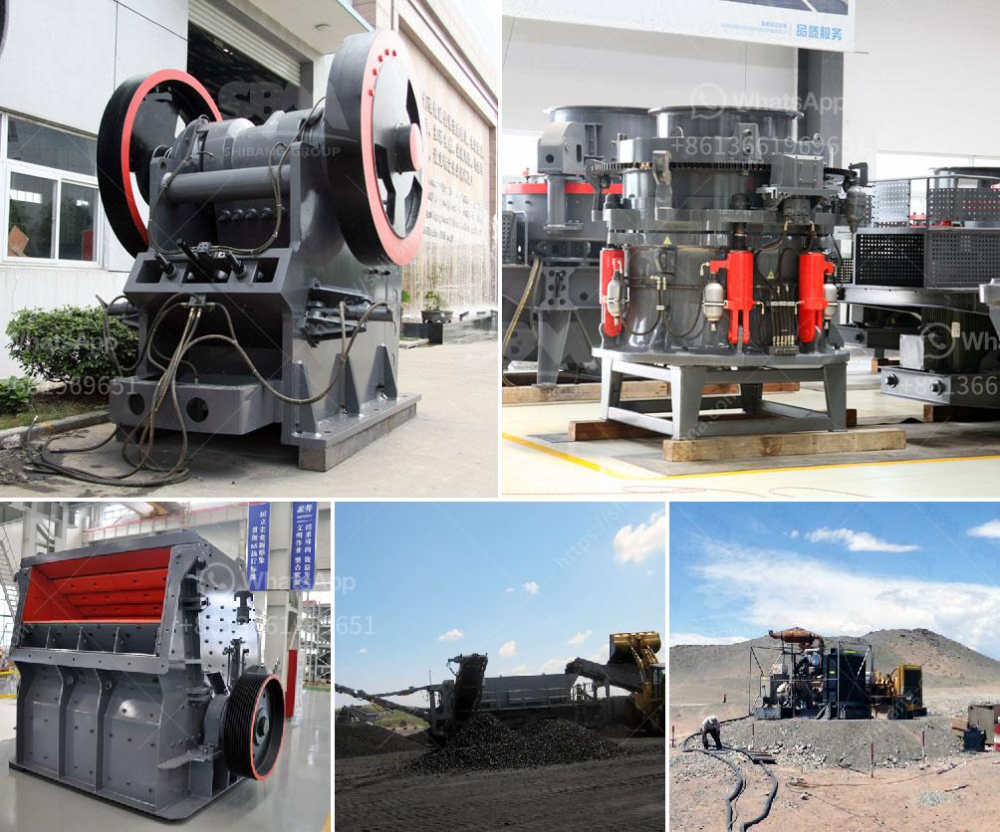

<h3>ball mill supliers in south africa</h3>
South Africa is classified as an upper-middle-income economy, one of only eight such countries in Africa. It is considered a newly industrialized country and a prominent player in the African continent. The South African economy is the second-largest in Africa, with a well-developed manufacturing sector and a strong mining industry. The mining industry in South Africa contributes significantly to the country's GDP and exports, making it crucial for the economic growth and development of the nation.

Within the mining industry, ball mill suppliers are crucial components in the production cycle. Ball mill manufacturers South Africa are known for their exceptional ability to process and source mining equipment. Utilized in a variety of mining industries, these mills serve as essential pieces of machinery for mineral processing procedures. The purpose of ball mills is to grind material into a pulverized state, which increases the efficiency of mineral extraction processes. The process involves using a rotating drum filled with grinding media (usually steel balls or rods) to crush, grind, or rotate materials, enhancing the milling or grinding process.

Several reputed ball mill suppliers in South Africa offer premium-quality equipment to Africa's mining industry. In mining, processing, these mills are essential for grinding mineral ores and other materials to finer tolerances. The sheer amount of heavy-duty equipment necessary for the mining industry demands top-notch quality, reliable machinery. For instance, ball mills are used to extract precious metals, minerals, and other valuable commodities from the earth.

Ball mill suppliers in South Africa play a significant role in the mining industry. They provide mining equipment to meet the growing demand for products used in mining operations and mineral processing plants across various industries. These mills are utilized in primary and secondary grinding stages to process different ores. The crushed ore is then further processed to separate the valuable minerals from the gangue or waste material.

The demand for ball mills in the South African mining industry has been increasing as mining companies seek efficient and cost-effective solutions to extract valuable minerals. With the ever-changing mining landscape and technological advancements, ball mill suppliers in South Africa need to stay informed and adaptable to meet these demands. They need to continue providing cutting-edge solutions that adhere to safety regulations and comply with environmental standards.

To thrive in the South African mining industry, ball mill suppliers must focus on efficient supply chain management and build strong relationships with mining companies. Reliable deliveries, superior after-sales service, and prompt technical support are key elements that suppliers must commit to delivering to remain competitive in this industry. Additionally, investing in research and development to improve equipment performance, increase energy efficiency, and reduce downtime will contribute to long-term success.

In conclusion, ball mill suppliers in South Africa play a vital role in the mining industry. These mills are crucial for reducing the size of ore and extracting valuable minerals from the extracted material. As the demand for robust and reliable equipment increases, suppliers must continue to innovate and meet the changing needs of the mining industry to ensure sustainable growth and development in South Africa.
<h3>Contact us</h3><ul><li><strong>Whatsapp:&nbsp;<a href="https://wa.me/8613661969651">+8613661969651</a></strong></li><li><a href="https://swt.shibang-china.com/?git&amp;zhl&amp;ball mill supliers in south africa"><strong>Online Service(chat now)</strong></a></li></ul><h3>Related</h3><ul><li><a href='used rock crushers for sale in germany.md'>used rock crushers for sale in germany</a></li><li><a href='concrete crusher machine for sale.md'>concrete crusher machine for sale</a></li><li><a href='stone crusher machine price portable.md'>stone crusher machine price portable</a></li><li><a href='gold stamp mill for sale in china.md'>gold stamp mill for sale in china</a></li><li><a href='large jaw crusher for sale.md'>large jaw crusher for sale</a></li></ul>