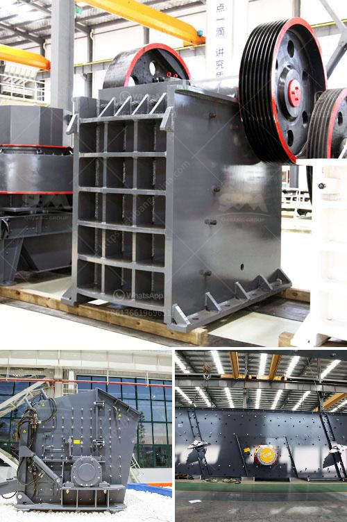

<h3>ball mill suppliers china</h3>
Are you searching for reliable ball mill suppliers in China? If yes, then you have come to the right place. A ball mill is a type of grinder used to grind materials into extremely fine powder for use in mineral dressing processes, paints, pyrotechnics, ceramics, and selective laser sintering. The ball mill is a key piece of equipment for grinding crushed materials, and it is widely used in production lines for powders such as cement, silicates, refractory material, fertilizer, glass ceramics, etc.

When it comes to ball mill suppliers, China is a fantastic country to source from. Not only are some of the best ball mill manufacturers in China, but also they provide brilliant services for ball mill machine. Hongxing Machinery is one of the renowned manufacturers and exporters of different grinding machines including ball mills, hammer mills, jaw crushers, pulverizers, and others.

The company’s innovative designs and quality-oriented approach towards product development has made it an industry leader. From supplying equipment to the mining industry, to the construction industry and fertilizer plants, ball mills have proven to be essential maChines in countless applications. With such a huge demand for these grinding machines, it’s no wonder that numerous ball mill suppliers have mushroomed in China.

To meet the ever-increasing market demand, Hongxing Machinery manufactures ball mills on a large scale. The company not only provides ball mills that are reliable and consistent but also valuable and highly customizable. It emphasizes the production of high-quality equipment that can stand the test of time.

China is renowned for its excellent technology and advanced manufacturing capabilities. This lends itself well to producing top-notch ball mills. Many ball mill suppliers in China, as well as worldwide, ensure the quality and performance of their machines. Some of the most reputed ball mill suppliers in China include Xinhai and Hongxing Mining Machinery.

China rightly holds a higher rank amongst the top ball mill suppliers. From this country, one can find hundreds of ball mill manufacturers, exporting their products to various global clientele. They cater to mineraI processing and drying industries, granulating and coating industries, and construction chemicals industry, just to name a few.

So, if you are in need of a ball mill, look no further. China is home to brilliant ball mill suppliers who can provide you the best quality machine for all your grinding needs. With decades of experience and a strong technical base, Hongxing Machinery is the go-to manufacturer and supplier of ball mills to the mining industry.
<h3>Contact us</h3><ul><li><strong>Whatsapp:&nbsp;<a href="https://wa.me/8613661969651">+8613661969651</a></strong></li><li><a href="https://swt.shibang-china.com/?git&amp;zhl&amp;ball mill suppliers china"><strong>Online Service(chat now)</strong></a></li></ul><h3>Related</h3><ul><li><a href='types coal ball mill.md'>types coal ball mill</a></li><li><a href='crusher price in europe.md'>crusher price in europe</a></li><li><a href='ball mill 5kg capacity price.md'>ball mill 5kg capacity price</a></li><li><a href='100tpd cement mill manufacturers.md'>100tpd cement mill manufacturers</a></li><li><a href='quartz stone powder machine manufacturing in india.md'>quartz stone powder machine manufacturing in india</a></li></ul>