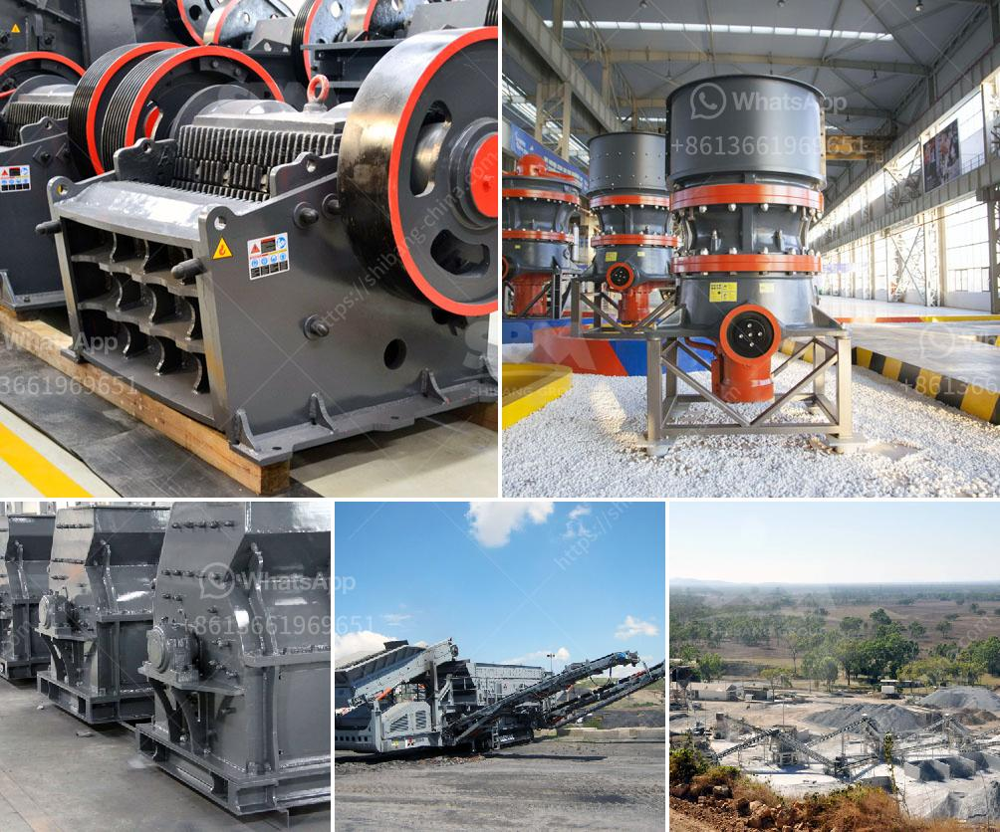

<h3>ball milling equipment and milling media</h3>
Ball milling is a technique that uses media (such as balls or beads) as grinding materials to break down substances into finer particles. The milling process is commonly used for reducing the size of the particles or mixing materials together to create new ones.

Ball milling equipment consists of a grinding chamber, where the materials are placed, and a rotating drum with grinding media (balls or beads) inside. The porous structure of the balls helps to create additional surface area and enhance the grinding efficiency. The equipment also includes a motor, which drives the drum and rotates the media at a predetermined speed.

Milling media, also known as grinding media, are the materials used to perform the milling process. There are various types of milling media available, such as ceramic balls, flint pebbles, stainless steel balls, and tungsten carbide balls. Each type of media has its own distinct properties and advantages, depending on the specific application.

Ceramic balls are a commonly used type of milling media due to their durability, high density, and excellent wear resistance. They are suitable for both wet and dry milling processes and are highly resistant to corrosion, making them ideal for grinding corrosive materials.

Flint pebbles are another popular choice for milling media. They are made from natural flint rocks, which are highly durable and resistant to abrasion. Flint pebbles are often used in the ceramics industry, as they provide excellent results when milling glazes, frits, and other raw materials.

Stainless steel balls are commonly used in the food processing and pharmaceutical industries due to their hygienic properties. They are resistant to corrosion, easy to clean, and provide efficient grinding results.

Tungsten carbide balls are widely used in the mining and metallurgical industries, as they are extremely hard and can grind even the toughest materials. They are suitable for high-energy ball milling processes and can withstand high temperatures and pressures.

When selecting milling media, it is essential to consider factors such as the desired particle size, material hardness, chemical compatibility, and contamination risks. It is also crucial to properly maintain and clean the milling media to ensure optimal performance and prevent cross-contamination between different materials.

In conclusion, ball milling equipment and milling media are crucial components in the milling process, transforming materials into finer particles or creating new composites. The choice of milling media depends on the desired grinding outcome and the specific application at hand. Different types of media offer unique properties, such as durability, wear resistance, and corrosion resistance. A thorough understanding of these factors is essential to select the most suitable milling media and achieve the desired results.
<h3>Contact us</h3><ul><li><strong>Whatsapp:&nbsp;<a href="https://wa.me/8613661969651">+8613661969651</a></strong></li><li><a href="https://swt.shibang-china.com/?git&amp;zhl&amp;ball milling equipment and milling media"><strong>Online Service(chat now)</strong></a></li></ul><h3>Related</h3><ul><li><a href='roll mills supplier in karachi.md'>roll mills supplier in karachi</a></li><li><a href='crusher and screening equipment price in south africa.md'>crusher and screening equipment price in south africa</a></li><li><a href='ball mill 5kg capacity price.md'>ball mill 5kg capacity price</a></li><li><a href='iron ore processing pdf.md'>iron ore processing pdf</a></li><li><a href='small quartz appratus for crushing.md'>small quartz appratus for crushing</a></li></ul>