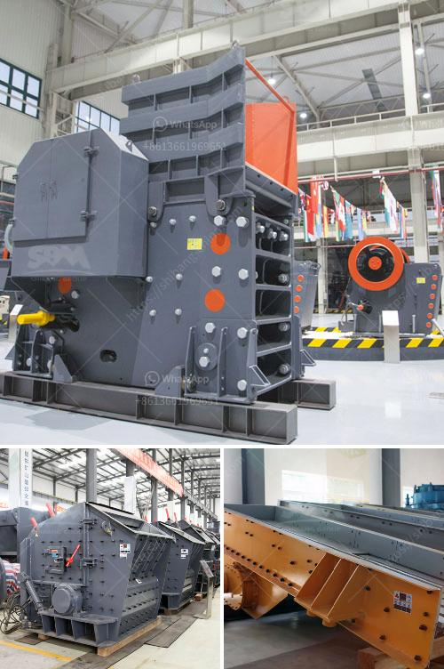

<h3>ball milling in spray preparation</h3>
Ball milling is a technique used in the formulation of spray coatings, which are commonly used in various industries such as automotive, aerospace, and electronics. The process involves the use of a ball mill, which is a cylindrical device with a rotating drum filled with spherical grinding media, to grind the coating material to a fine powder.

The main purpose of ball milling in spray preparation is to achieve uniform particle size distribution and enhance the flowability of the coating material. This is crucial for successful spray application, as it ensures consistent coating thickness and adhesion.

One of the key advantages of ball milling is its ability to effectively break down agglomerates and reduce the particle size of the coating material. Agglomerates are clusters of particles that form during the mixing and handling of powders, and they can negatively impact the spray coating process by causing clogging in the spray nozzle or uneven coating thickness. By subjecting the coating material to the grinding action of the balls in the ball mill, agglomerates are broken apart and the particle size is reduced, resulting in a more uniform and flowable powder.

In addition to size reduction, ball milling also helps in homogenizing the composition of the coating material. Many spray coatings are formulated using a combination of different powders, binders, and additives. These components may have different particle sizes and properties, and ball milling helps to mix them thoroughly, ensuring a homogeneous and well-dispersed formulation.

The choice of grinding media used in the ball mill also plays a significant role in the spray preparation process. Grinding media can be made of various materials, such as stainless steel, ceramic, or even tungsten carbide, each with its own distinct properties. The selection of appropriate grinding media depends on factors such as the hardness and abrasiveness of the coating material, desired particle size, and the corrosion resistance of the media. It is important to choose the right type of grinding media to ensure optimal grinding efficiency and minimize contamination.

To achieve satisfactory results in spray preparation, it is crucial to carefully control the milling parameters. Parameters such as ball size, ball-to-powder ratio, rotation speed, and milling time can significantly influence the particle size, morphology, and overall quality of the coating material. It is necessary to determine the optimum conditions through experimentation and careful analysis to achieve the desired coating properties.

In conclusion, ball milling is a valuable technique in spray preparation that enables the production of uniform, flowable, and well-mixed coating materials. By reducing agglomerates and achieving a homogeneous composition, ball milling ensures the success of the spray coating process, leading to high-quality and consistent coatings.
<h3>Contact us</h3><ul><li><strong>Whatsapp:&nbsp;<a href="https://wa.me/8613661969651">+8613661969651</a></strong></li><li><a href="https://swt.shibang-china.com/?git&amp;zhl&amp;ball milling in spray preparation"><strong>Online Service(chat now)</strong></a></li></ul><h3>Related</h3><ul><li><a href='marble crusher machine.md'>marble crusher machine</a></li><li><a href='roller crusher company.md'>roller crusher company</a></li><li><a href='gold processing leaching plant.md'>gold processing leaching plant</a></li><li><a href='gypsum powder production equipment price.md'>gypsum powder production equipment price</a></li><li><a href='iron ore beneficiation process for sale.md'>iron ore beneficiation process for sale</a></li></ul>