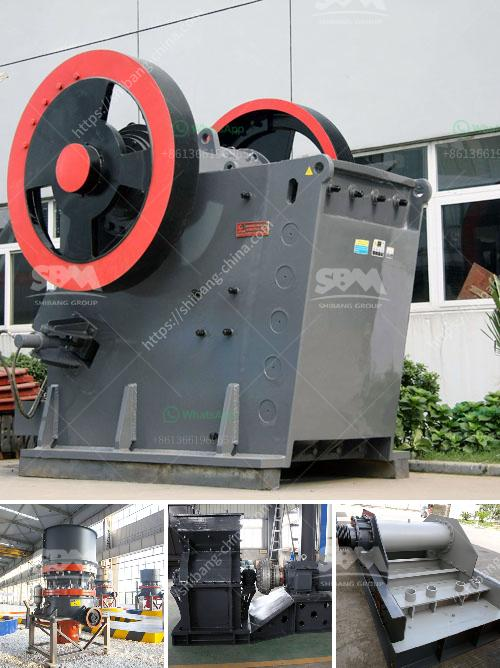

<h3>ball mills caractecrsistiacs techniques</h3>
Ball mills are machinery designed to break down large chunks of solid material into smaller particles. They are commonly used in the mining and cement industries to reduce the size of ore or rock for further processing. In this article, we will explore the characteristics and techniques used in ball mills.

1. Size and Capacity: Ball mills can vary in size from small laboratory models measuring a few feet in diameter, to large machines several meters in diameter. They are capable of handling capacities ranging from a few kilograms to several tons per hour.

2. Grinding Medium: The grinding medium in a ball mill typically consists of steel balls or ceramic media. The material to be ground is loaded into the cylinder along with the grinding medium. As the drum rotates, the grinding medium impacts and grinds the material, facilitating the desired size reduction.

3. Rotation Speed: The rotation speed of a ball mill determines the lifting effects of the grinding media, impacting the material. Different speeds can generate different forces, influencing the overall grinding efficiency. Optimal rotation speed varies depending on the specific material being processed.

4. Milling Time: The longer the material stays inside the ball mill, the finer the final product will be. However, extended milling can consume more energy. The balance between milling time and desired particle size is a crucial consideration during operation.

1. Batch and Continuous Operation: Ball mills can operate in batch or continuous modes. In batch operation, the material is fed into the mill in discrete portions, then discharged once the desired size is attained. Continuous operation involves feeding and discharging material simultaneously, allowing for higher production rates.

2. Control of Particle Size: Particle size control is achieved through various techniques. One common method involves controlling the size of the grinding media. By using different-sized balls, the desired range of particle sizes can be achieved. Additionally, adjusting the rotational speed and milling time also influence particle size distribution.

3. Dry or Wet Grinding: Ball mills can operate in dry or wet conditions. Dry grinding is more common, often used in mining applications where the ore needs to be dry, as water can react with the ore causing unwanted chemical reactions. However, wet grinding is advantageous in situations where a finer particle size or a more homogeneous mixture is desired.

4. Milling Aids: To enhance the grinding process, milling aids can be added to the mill. These additives can improve efficiency, reduce clumping of particles, and control the rheological properties of the slurry. Common milling aids include dispersants, grinding aids, and lubricants.

Ball mills are versatile machines that have revolutionized the mining and cement industries. Their characteristics, such as size, grinding medium, rotation speed, and milling time, allow for precise control over the final particle size and production rate. Whether in batch or continuous operation, dry or wet conditions, ball mills offer a reliable method for size reduction. Utilizing appropriate milling techniques and additives further enhance their efficiency and effectiveness.
<h3>Contact us</h3><ul><li><strong>Whatsapp:&nbsp;<a href="https://wa.me/8613661969651">+8613661969651</a></strong></li><li><a href="https://swt.shibang-china.com/?git&amp;zhl&amp;ball mills caractecrsistiacs techniques"><strong>Online Service(chat now)</strong></a></li></ul><h3>Related</h3><ul><li><a href='concrete crusher hire nigeria.md'>concrete crusher hire nigeria</a></li><li><a href='vertical shaft impact crusher technical specifications.md'>vertical shaft impact crusher technical specifications</a></li><li><a href='harga pasaran stone crusher.md'>harga pasaran stone crusher</a></li><li><a href='cost of crusher machine for grinding mica.md'>cost of crusher machine for grinding mica</a></li><li><a href='second hand mobile jaw crusher in spain.md'>second hand mobile jaw crusher in spain</a></li></ul>