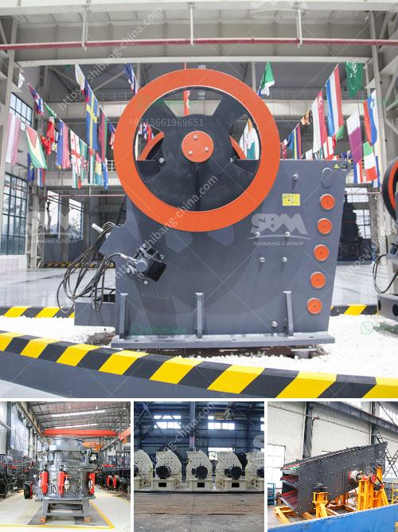

<h3>ball mills for measured mining</h3>
Ball mills are essential devices in the mining industry. Trained professionals use them to extract metals such as gold and copper from ores. These metals are used in a variety of industries, such as electronics, construction, and manufacturing.

Ball mills are commonly used to crush and grind materials into finer particles. From there, they are mixed with water, creating a slurry, which is then further refined through various processes.

The main components of a ball mill include a rotating cylindrical container that holds the grinding media (such as steel balls), motor, and base. The material to be crushed and ground is placed inside the container, as the container spins, the grinding media collides with the material, effectively reducing its size. The rotation also ensures that the material is evenly distributed within the container, allowing for efficient grinding.

Different types of ball mills are available, depending on the grinding requirements. Some ball mills are designed to operate in a closed circuit with a classifier, sorting the material and sending the oversized particles back to the mill for further grinding. Others are designed to continuously feed the material, ensuring a constant output.

Ball mills are robust and reliable pieces of equipment. However, like any mechanical device, they require regular maintenance to ensure optimal performance. This includes lubrication of the moving parts and regular inspections to identify any potential issues that may impact efficiency or safety.

In conclusion, ball mills play an essential role in the mining industry, enabling the extraction of valuable metals from ores. They are versatile devices that can grind and crush materials into various sizes, making them crucial for downstream processes in a wide range of industries. Ball mills are a reliable and efficient tool for measured mining operations, ensuring the extraction of metals in a cost-effective and sustainable manner.
<h3>Contact us</h3><ul><li><strong>Whatsapp:&nbsp;<a href="https://wa.me/8613661969651">+8613661969651</a></strong></li><li><a href="https://swt.shibang-china.com/?git&amp;zhl&amp;ball mills for measured mining"><strong>Online Service(chat now)</strong></a></li></ul><h3>Related</h3><ul><li><a href='ball mill suppliers china.md'>ball mill suppliers china</a></li><li><a href='25 used crushing machine price.md'>25 used crushing machine price</a></li><li><a href='granite crushing production line.md'>granite crushing production line</a></li><li><a href='used crushers in germany for sale.md'>used crushers in germany for sale</a></li><li><a href='stone crushing equipment zenith.md'>stone crushing equipment zenith</a></li></ul>