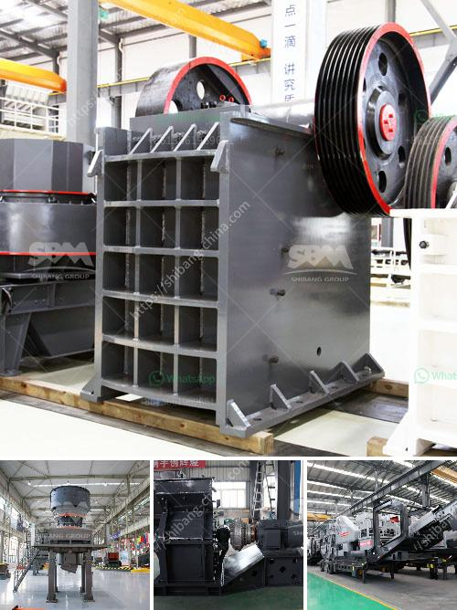

<h3>ball mills for mining in china</h3>
Ball mills are used for grinding materials such as coal, pigments, and feldspar for pottery. Grinding can be carried out either wet or dry, but the former is performed at low speed. Blending of explosives is an example of an application for rubber balls. For systems with multiple components, ball milling has been shown to be effective in increasing solid-state chemical reactivity. Additionally, ball milling has been shown effective for production of amorphous materials.

In mining, the use of ball mills is essential in the comminution process. Ball mills are used for grinding materials into very fine particles, which greatly facilitates subsequent extraction processes. Once broken down, the material can be extracted from the ground more efficiently.

China has become one of the largest mining markets worldwide, with the country significantly investing in the mining industry. The demand for ball mills for mining in China is also increasing. Additionally, government initiatives, such as the "Belt and Road" infrastructure development plan, have further boosted the mining industry.

China's mining industry primarily relies on energy-intensive ball mills. Due to the increasing energy demand, mining companies are searching for alternative ways to reduce energy consumption. In response to this demand, China has made significant advancements in the development of more energy-efficient ball mills.

One such advancement is the introduction of high-efficiency ball mills. These ball mills are specially designed to reduce energy consumption while maintaining the same level of productivity. The grinding efficiency of these mills has been greatly improved, resulting in substantial energy savings.

Another development in the field of ball mills for mining is the use of variable frequency drives (VFDs). VFDs provide energy savings by adjusting the speed and torque of the motor to match the actual requirements of the mill. By optimizing the grinding process, VFDs can save a significant amount of energy, further reducing the overall environmental impact of mining operations.

Furthermore, the use of advanced control systems in ball mills has also contributed to energy savings. These control systems continuously monitor the grinding process and make real-time adjustments to optimize the operation. By automatically adjusting parameters such as mill speed, feed rate, and ball size, these systems ensure the most efficient use of energy.

China has also been investing in the development of sustainable mining practices. This includes the use of renewable energy sources, such as solar and wind power, to generate electricity for mining operations. By integrating renewable energy sources into the power supply for ball mills, the carbon footprint of mining can be greatly reduced.

In conclusion, ball mills are crucial in the mining industry for reducing large-sized particles into smaller ones, facilitating the extraction process. China's mining industry has been experiencing significant growth, and the demand for energy-efficient ball mills is on the rise. China's commitment to reducing energy consumption and developing sustainable mining practices has led to the introduction of high-efficiency ball mills, VFDs, and advanced control systems. These advancements not only help in reducing energy consumption but also contribute to the overall sustainability of mining operations.
<h3>Contact us</h3><ul><li><strong>Whatsapp:&nbsp;<a href="https://wa.me/8613661969651">+8613661969651</a></strong></li><li><a href="https://swt.shibang-china.com/?git&amp;zhl&amp;ball mills for mining in china"><strong>Online Service(chat now)</strong></a></li></ul><h3>Related</h3><ul><li><a href='used concrete crusher manufacturer in malaysia.md'>used concrete crusher manufacturer in malaysia</a></li><li><a href='stone crushing business in pakistan.md'>stone crushing business in pakistan</a></li><li><a href='jaw crusher 200 tph parts details.md'>jaw crusher 200 tph parts details</a></li><li><a href='stone crusher 7 tonne per day.md'>stone crusher 7 tonne per day</a></li><li><a href='granite crushers in germany.md'>granite crushers in germany</a></li></ul>