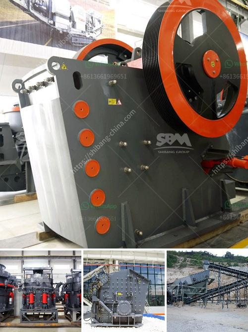

<h3>ball mills for mining of 5000 tons per hour</h3>
Ball mills are a vital tool for mining and ore processing. They are used to pulverize and grind materials down to a desired size, making them extremely efficient and cost-effective. With a capacity of 5000 tons per hour, these mills are perfect for a range of mining applications, including gold, copper, and iron ore processing.

A ball mill is a cylindrical device that rotates and grinds materials into a fine powder. It consists of a hollow shell that is partially filled with grinding media, such as steel or ceramic balls. The material to be ground is fed into the shell continuously and is crushed and ground by the impact and attrition forces generated by the rotating shell and grinding media.

The large capacity of these ball mills allows them to handle a high throughput of material. This is especially important in mining operations, where the ore extracted needs to be processed quickly and efficiently to maximize the production and revenue. With a capacity of 5000 tons per hour, these mills can process a significant amount of ore in a short period, ensuring a continuous flow of material for downstream processing.

In addition to their high capacity, ball mills for mining are also known for their versatility. They can grind a wide range of materials, including hard rock, ore, limestone, and granite. This flexibility allows mining companies to process various types of material and extract valuable minerals. The efficiency of the ball mill is also enhanced by the use of grading liners, which help classify the size of the grinding media and ensure that the desired fine particles are produced.

Apart from the grinding process, ball mills for mining are also used for mixing and blending purposes. They can be used to mix different materials to create homogeneous slurries or to blend two or more materials together. This is particularly useful in mining operations where multiple materials need to be combined before further processing.

Another advantage of ball mills in mining is their low operating costs. Unlike other milling equipment, such as rod mills or SAG mills, which require regular maintenance and replacement of liners, ball mills have a relatively simple design and require minimal maintenance. This helps reduce downtime and operational costs, making them an efficient and cost-effective choice for mining operations.

In conclusion, ball mills for mining with a capacity of 5000 tons per hour are an essential piece of equipment in the mining industry. They are used to pulverize and grind the ore to extract valuable minerals and ensure a continuous flow of material for downstream processing. With their high capacity, versatility, and low operating costs, these mills are the perfect choice for mining operations that require a large throughput of ore.
<h3>Contact us</h3><ul><li><strong>Whatsapp:&nbsp;<a href="https://wa.me/8613661969651">+8613661969651</a></strong></li><li><a href="https://swt.shibang-china.com/?git&amp;zhl&amp;ball mills for mining of 5000 tons per hour"><strong>Online Service(chat now)</strong></a></li></ul><h3>Related</h3><ul><li><a href='ethiopia stone crushing industry.md'>ethiopia stone crushing industry</a></li><li><a href='ton gold wash plant for sale.md'>ton gold wash plant for sale</a></li><li><a href='technical data sheet of stone crusher.md'>technical data sheet of stone crusher</a></li><li><a href='philippines crusher cebu crusher.md'>philippines crusher cebu crusher</a></li><li><a href='copper ore processing machines in usa.md'>copper ore processing machines in usa</a></li></ul>