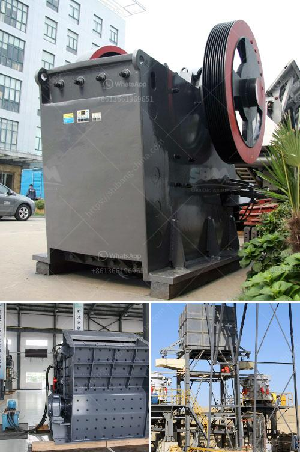

<h3>ball mills in vizag</h3>
The industrial sector plays a key role in driving economic growth in Visakhapatnam, a major industrial hub in Andhra Pradesh. Ball mills are one of the most indispensable and yet most underutilized equipment in many industries. A ball mill is a type of grinder used to grind materials into extremely fine powder for use in mineral dressing processes, paints, pyrotechnics, ceramics, and selective laser sintering. The ball mill is an essential piece of equipment for grinding crushed materials, and it is widely used in production lines for powders such as cement, silicates, refractory material, fertilizer, glass ceramics, etc.

Visakhapatnam is home to numerous industries that rely on ball mills for their grinding needs. Given its wealth of mineral resources, it is no wonder that the city is a hotspot for industries such as steel, cement, and ceramics. Besides these core industries, ball mills are also used in the production of paints, pyrotechnics, and ceramics, making them an essential tool for a wide range of applications.

The primary function of a ball mill is to break down large-sized rocks into smaller-sized rocks or even into fine powder. As the cylindrical vessel rotates, steel balls tumble and crush the mineral ores to achieve the desired fineness. The quality of the finished product depends on the size and composition of the steel balls and the rotational speed of the ball mill.

In Visakhapatnam, many industries are regularly using ball mills during their manufacturing process. The steel industry, for instance, relies heavily on ball mills to process coke, iron ore fines, and fluxing agents. Small variations in the feed rate, ore hardness, and properties of grinding media can result in significant fluctuations in throughput, power draw, and product grind size. Achieving optimal conditions for grinding requires a deep understanding of the process parameters and the use of appropriate technologies, like ball mills.

Another important industry in Visakhapatnam that utilizes ball mills is the ceramics industry. The ceramics industry is known for its intricate ceramic products, such as tiles, sanitaryware, and advanced ceramics. The ball mill in the ceramic industry is used for grinding purposes and utilizes high-purity ceramic balls as grinding media. Choosing the right combination of grinding media and mill internals can greatly improve the energy efficiency of these mills, resulting in significant cost savings for ceramic manufacturers.

In recent years, the technology and machinery used in ball mills have advanced significantly. Modern ball mills have various innovative features, like integrated drive systems, temperature control, and grinding aids. These advancements have made ball mills more versatile, efficient, and cost-effective. The integration of automation and remote monitoring systems has streamlined the grinding process, reducing downtime and maximizing productivity.

Despite the well-established benefits of ball mills and their extensive use in various industries in Visakhapatnam, there is still untapped potential for further growth. By leveraging advanced technologies and focusing on research and development, local industries can unlock the full potential of ball mills. Furthermore, collaborations between industry players and academic institutions can facilitate knowledge exchange, leading to improved grinding techniques and the development of customized solutions tailored to specific industry needs.

In conclusion, ball mills are an indispensable tool in the grinding process for various industries in Visakhapatnam. Their ability to grind and homogenize materials efficiently makes them vital for achieving desired product specifications. With continuous technological advancements and a proactive approach towards research and development, the potential of ball mills can be fully realized, further driving the growth and progress of the industrial sector in Vizag.
<h3>Contact us</h3><ul><li><strong>Whatsapp:&nbsp;<a href="https://wa.me/8613661969651">+8613661969651</a></strong></li><li><a href="https://swt.shibang-china.com/?git&amp;zhl&amp;ball mills in vizag"><strong>Online Service(chat now)</strong></a></li></ul><h3>Related</h3><ul><li><a href='barite grinding plants in nigeria.md'>barite grinding plants in nigeria</a></li><li><a href='screen for iron ore pellets.md'>screen for iron ore pellets</a></li><li><a href='biaya conveyor belt per meter instalasi.md'>biaya conveyor belt per meter instalasi</a></li><li><a href='iron slag crushing ball mill in nagpur.md'>iron slag crushing ball mill in nagpur</a></li><li><a href='stone crushers poland.md'>stone crushers poland</a></li></ul>