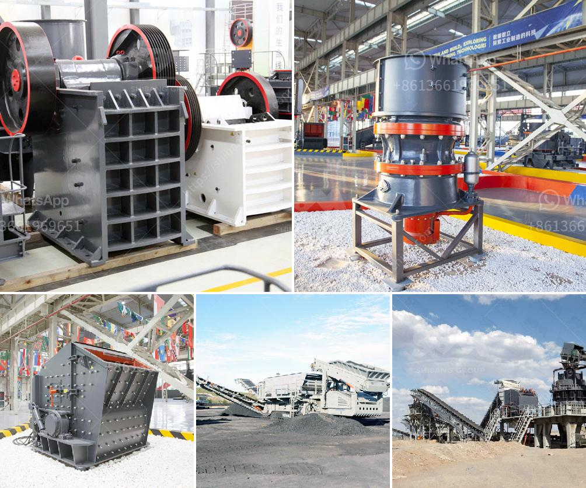

<h3>ball mills machine</h3>
Ball mills are a type of grinding equipment, commonly used in mineral processing and mining industries. They are cylindrical devices shaped like a drum, filled with grinding media such as steel balls, ceramic beads, or stainless steel cylinders. The material to be ground is added into the drum, along with the grinding media, and the drum is rotated, causing the media to grind the material to the desired size.

The main purpose of ball mills is to grind materials into extremely fine powder, with sizes ranging from a few micrometers to several nanometers. They are widely used in the production of cement, silicate products, fertilizers, glass, ceramics, and other industries. Additionally, ball mills can be used in the milling of pharmaceuticals, ores, and various chemical substances.

One of the key advantages of ball mills is their versatility. They can perform both wet and dry grinding operations, allowing for maximum flexibility in processing different materials. The grinding process in a ball mill involves impact and attrition between the media and the particles, resulting in size reduction.

Another advantage of ball mills is their relatively simple design, making them easy to operate and maintain. They consist of a rotating drum, partially filled with grinding media, and a motor that drives the drum rotation. The size and design of the grinding media can be customized to suit the specific requirements of the application.

Ball mills are also known for their energy efficiency. The grinding action within a ball mill is responsible for the consumption of significant amounts of energy. However, modern ball mills are designed to minimize energy consumption while maximizing grinding performance. This is achieved through the use of advanced control systems, improved grinding media, and efficient drive systems.

In conclusion, ball mills are powerful tools for grinding and blending materials in various industrial applications. Their versatility, simplicity, and energy efficiency make them a popular choice for both small-scale production and large-scale operations. Whether for cement production, mineral processing, or pharmaceutical applications, ball mills offer reliable performance for grinding and reducing materials to the desired size.
<h3>Contact us</h3><ul><li><strong>Whatsapp:&nbsp;<a href="https://wa.me/8613661969651">+8613661969651</a></strong></li><li><a href="https://swt.shibang-china.com/?git&amp;zhl&amp;ball mills machine"><strong>Online Service(chat now)</strong></a></li></ul><h3>Related</h3><ul><li><a href='buy sand washing plant in sri lanka.md'>buy sand washing plant in sri lanka</a></li><li><a href='kaolin crusher price.md'>kaolin crusher price</a></li><li><a href='coal crusher 350tph.md'>coal crusher 350tph</a></li><li><a href='mining crusher plant limestone process.md'>mining crusher plant limestone process</a></li><li><a href='kenya cone crusher is manufactured.md'>kenya cone crusher is manufactured</a></li></ul>