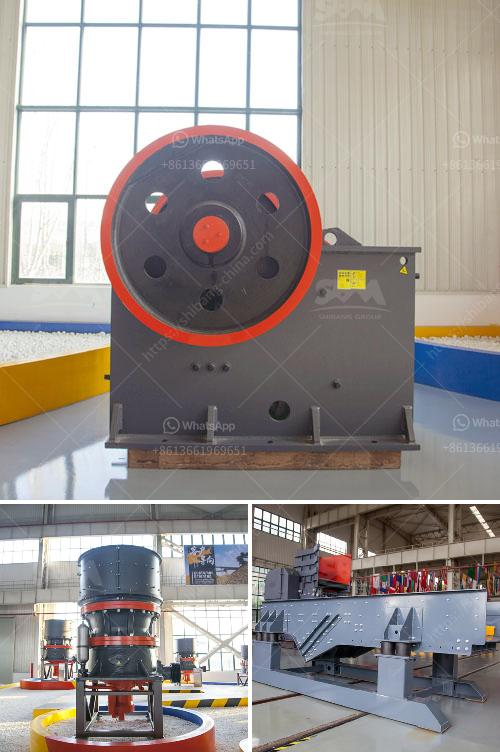

<h3>ball mills malaysia</h3>
Ball mills have been widely used in the mining industry for decades, as they are crucial equipment for grinding ores into fine particles. With the increasing demand for energy-efficient alternatives to conventional crushing and grinding methods, ball mills have gained significant popularity in the Malaysian market.

Malaysia is a thriving country with a growing industrial sector. As the demand for minerals and metals continues to rise, the mining industry plays a vital role in driving the country's economic growth. Ball mills are an essential tool for this industry, as they are capable of efficiently grinding tough materials into fine particles necessary for mineral extraction.

One of the main benefits of using ball mills is their versatility. They can be used for both dry and wet grinding processes, making them suitable for a wide range of applications. In the mining industry, ball mills are primarily used for grinding ores and other minerals, such as copper, gold, and iron ore. They are also used in the production of cement, silicates, refractory materials, fertilizers, glass, and ceramics.

The rising demand for energy-efficient technologies has prompted the development of innovative ball mill designs. Manufacturers in Malaysia have been focusing on producing ball mills that consume minimal energy while delivering high performance. These advancements have significantly reduced operating costs for mining companies, making ball mills an attractive investment.

Another advantage of ball mills is their ability to handle large capacities. With the increasing demand for minerals, mills with higher throughput are required to meet production targets. Malaysian manufacturers have responded to this demand by developing ball mills with larger capacities, allowing mining companies to achieve higher outputs in a shorter timeframe.

The quality of ball mills produced in Malaysia is also worth noting. Manufacturers in the country adhere to strict quality control measures to ensure that their products meet international standards. This commitment to quality has earned Malaysian ball mills a good reputation worldwide, leading to increased export opportunities.

Furthermore, the Malaysian government has been supportive of the mining industry, implementing favorable policies to attract foreign investments. This support includes offering tax incentives, simplified business procedures, and infrastructure development, making Malaysia an attractive destination for mining companies looking to establish operations.

Investing in ball mills in Malaysia can lead to many benefits for mining companies. The energy efficiency and high performance of these mills can significantly reduce operating costs, while their large capacities allow for increased production. Additionally, the high quality of Malaysian ball mills and the supportive government policies make it a promising investment for the future.

In conclusion, ball mills are an essential tool for the mining industry in Malaysia. Their versatility, energy efficiency, and large capacity make them crucial equipment for grinding ores and other minerals. The high quality of Malaysian ball mills, coupled with favorable government policies, make investing in this sector a wise decision for mining companies looking to optimize their operations and drive future growth.
<h3>Contact us</h3><ul><li><strong>Whatsapp:&nbsp;<a href="https://wa.me/8613661969651">+8613661969651</a></strong></li><li><a href="https://swt.shibang-china.com/?git&amp;zhl&amp;ball mills malaysia"><strong>Online Service(chat now)</strong></a></li></ul><h3>Related</h3><ul><li><a href='cement making machines for factory.md'>cement making machines for factory</a></li><li><a href='nigeria grinding mills price.md'>nigeria grinding mills price</a></li><li><a href='bentonite granules making machinery india.md'>bentonite granules making machinery india</a></li><li><a href='harga jaw crusher 400x600.md'>harga jaw crusher 400x600</a></li><li><a href='indonesia jaw crusher.md'>indonesia jaw crusher</a></li></ul>