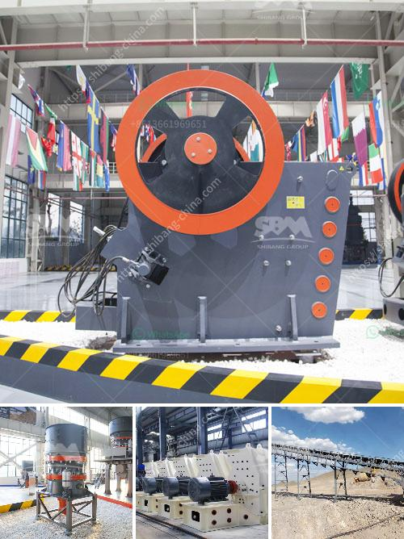

<h3>ballast crusher for sale kenya</h3>
Many customers in Kenya are interested into the diesel engine ballast crushing machine, here I will introduce some hot small models for small mining and quarry plant. Diesel engine stone ballast crusher machine is a type of diesel engine crusher. There is a simple type diesel engine stone ballast crushing machine, which is an only ballast crusher machine with a diesel engine. But now I introduce is a model which the crusher and diesel engine is on a structure and which can be designed into mobile type also.

This type diesel engine ballast crushing machine is easy to operate in the progress of crushing. Besides, the most attractive feather is the lower cost, so it makes a lot of customers choose it.

This article will provide you with the detailed prices of the ballast crusher and a brief introduction to the performance of ballast crusher. Ballast crusher is the necessary equipment when processing the ballast into small pieces or particle size. we have kinds of ballast crusher machines for sale.

The crushing efficiency of the ballast crusher is relatively high and can crush the stone into cubic particles. Due to its wide application, it is also called ballast crusher or ballast crusher machine.

The sand and gravel can be divided into two grades according to the particle size: coarse aggregate and fine aggregate. The coarse aggregate is the stone which has been crushed by the crushing machine, which is mainly used for the building and construction industries. The fine aggregate is the product of adding a certain amount of cement to the sand. It is commonly used in modern construction.

Therefore, the demand for ballast crusher is increasing. Why choose our company as a ballast crusher supplier? First of all, the company only uses high-quality materials. The selected materials are used for the production of each component of the ballast crusher. It ensures the long-term service life of the equipment and reduces the maintenance rate.

Secondly, the company's ballast crusher adopts advanced welding and assembly technology. Welded together and equipped with advanced technology that it will not be dismantled for a long time. It is also equipped with an intelligent automatic control system, which can ensure the long-term normal operation of the ballast crusher.

In conclusion, if you want to buy a high-quality ballast crusher, please contact us. We are looking forward to your sincere cooperation.
<h3>Contact us</h3><ul><li><strong>Whatsapp:&nbsp;<a href="https://wa.me/8613661969651">+8613661969651</a></strong></li><li><a href="https://swt.shibang-china.com/?git&amp;zhl&amp;ballast crusher for sale kenya"><strong>Online Service(chat now)</strong></a></li></ul><h3>Related</h3><ul><li><a href='ball mills machine.md'>ball mills machine</a></li><li><a href='iron slag crushing ball mill in nagpur.md'>iron slag crushing ball mill in nagpur</a></li><li><a href='jaw crusher in uganda.md'>jaw crusher in uganda</a></li><li><a href='roll mills supplier in karachi.md'>roll mills supplier in karachi</a></li><li><a href='model ball mill.md'>model ball mill</a></li></ul>