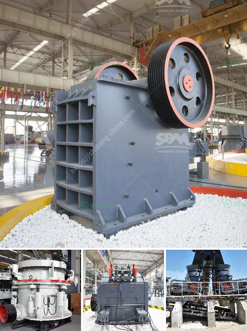

<h3>ballast crusher price</h3>
When it comes to the ballast, we will think of the heavy material, such as gravel, sand, iron, or coarse stone, placed below railway tracks to provide stability. But ballast is not limited to railway tracks; it is also used in various construction projects, such as roads, highways, buildings, and bridges.

To produce high-quality ballast, it is crucial to have a reliable ballast crusher machine. However, choosing a suitable machine can be a tricky task, especially when there are so many manufacturers and suppliers in the market. Moreover, the price of the machine plays an important role and can greatly affect your budget.

In this article, we will provide a comprehensive guide to understanding the ballast crusher price and factors that influence it.

The reputation, experience, and brand value of the manufacturer play a significant role in determining the crusher price. Established manufacturers with a good track record usually charge higher prices due to their expertise and quality assurance.

The crusher price is also correlated with the production capacity of the machine. Higher capacity machines tend to have a higher price tag. Consider your project requirements and select a machine with an appropriate capacity to ensure maximum efficiency and cost-effectiveness.

The quality and durability of the crusher machine directly affect its price. High-quality materials and advanced manufacturing techniques result in a more robust and long-lasting machine. While such machines might be pricier, they usually provide better value for money in the long run.

Different machines come with varying features and specifications, which can significantly influence the price. Some machines may have additional features like adjustable settings, automatic lubrication systems, or advanced control panels. Analyze your project needs and determine whether these extra features are essential before making a purchasing decision.

Reputable manufacturers often provide comprehensive after-sales services, including installation, maintenance, and technical support. These services may come at an additional cost, but they are crucial in ensuring the smooth operation and longevity of your machine. Consider the availability and quality of after-sales services provided by the manufacturer before finalizing the purchase.

The law of supply and demand also impacts the price of ballast crushers. If the demand for crushers is high and the competition is stiff, prices tend to be higher. On the other hand, during periods of less demand or increased competition, prices may be more competitive.

Selecting the right ballast crusher machine is essential for the success of your construction project. Understanding the factors that influence the crusher price can help you make an informed decision. Consider the reputation, capacity, quality, features, services, and market dynamics while comparing prices from different manufacturers.

Remember, it is not always about finding the cheapest option, but rather finding the best value for your money. A reliable and efficient ballast crusher machine may come with a higher price initially, but it can save you significant costs in the long run by providing consistent performance, durability, and reduced maintenance needs.
<h3>Contact us</h3><ul><li><strong>Whatsapp:&nbsp;<a href="https://wa.me/8613661969651">+8613661969651</a></strong></li><li><a href="https://swt.shibang-china.com/?git&amp;zhl&amp;ballast crusher price"><strong>Online Service(chat now)</strong></a></li></ul><h3>Related</h3><ul><li><a href='equipo del molino de bolas 750 hp precio del motor.md'>equipo del molino de bolas 750 hp precio del motor</a></li><li><a href='jaw crusher price in china.md'>jaw crusher price in china</a></li><li><a href='sand processing plant cost in russia.md'>sand processing plant cost in russia</a></li><li><a href='cost of crusher machine kenya.md'>cost of crusher machine kenya</a></li><li><a href='diamond mining equipment companies in usa.md'>diamond mining equipment companies in usa</a></li></ul>