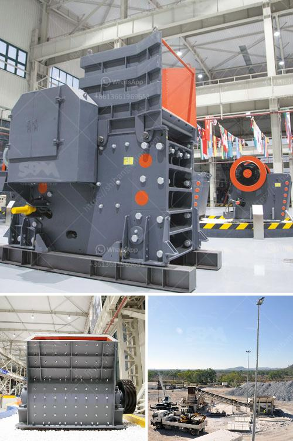

<h3>ballast crusher supplier</h3>
Are you searching for a reliable ballast crusher supplier? Look no further than Aimix Group, a leading supplier in the industry. We provide you with a wide variety of crusher equipment including impact crusher, cone crusher, jaw crusher and mobile crushing station. We guarantee that our products will be delivered on time and of high quality to meet your specific construction needs.

Ballast, also known as railroad track ballast, is a key element in the railway infrastructure. The ballast plays a crucial role in supporting and distributing the load of the trains to the sleepers. In addition, it holds the track in place and provides stability during train movements. Therefore, the quality of the ballast is of utmost importance in maintaining a safe and efficient railway system.

As a responsible supplier, we understand the significance of supplying high-quality ballast. We ensure that our ballast crusher machines have the best quality and performance for maximized productivity and efficiency. They can crush granite, basalt, limestone, river pebbles, railway ballast, construction waste and other materials.

We manufacture both fixed and mobile ballast crushing machines for different customer requirements. Jaw crusher is the most common ballast crusher machine in a quarry. Usually, it is mainly used as the primary crushing machine. Our jaw crusher PE series has the following features:

Besides, we also supply impact crusher, cone crusher and mobile crusher for different projects to meet diverse needs. We are experienced in customizing crushing solutions according to customer's specific requirements.

As a leading ballast crusher supplier in the market, we provide advanced and high-quality machines for all types of ballast crushing needs. Our expert team has more than 30 years of experience in this industry, ensuring that our products meet strict quality standards. We have taken every step to ensure the reliability and durability of our machines.

One of the advantages of choosing Aimix is our excellent after-sales service. We provide comprehensive support and assistance to our customers throughout the entire process – from purchase to installation, maintenance, and troubleshooting. Our team of experts is always on standby to answer any questions or concerns you may have.

At Aimix, we are committed to delivering value and satisfaction to our customers. We strive to provide the best ballast crusher machines at affordable prices without compromising on quality. We believe that taking care of our customers' needs is the key to our success. That is why we continuously invest in research and development to improve our products and exceed customer expectations.

In conclusion, choosing a reliable ballast crusher supplier is crucial for the success of your construction project. Aimix Group has the experience, expertise, and equipment to fulfill your needs. With our high-quality products and excellent service, we are confident that we can exceed your expectations. Contact us today and let us help you find the right ballast crusher for your project.
<h3>Contact us</h3><ul><li><strong>Whatsapp:&nbsp;<a href="https://wa.me/8613661969651">+8613661969651</a></strong></li><li><a href="https://swt.shibang-china.com/?git&amp;zhl&amp;ballast crusher supplier"><strong>Online Service(chat now)</strong></a></li></ul><h3>Related</h3><ul><li><a href='ball mill problems and solutions.md'>ball mill problems and solutions</a></li><li><a href='grinding wet ball mill limestone.md'>grinding wet ball mill limestone</a></li><li><a href='vibrating screen estimating.md'>vibrating screen estimating</a></li><li><a href='india stone crusher machine price.md'>india stone crusher machine price</a></li><li><a href='ethiopia stone crusher suppliers.md'>ethiopia stone crusher suppliers</a></li></ul>