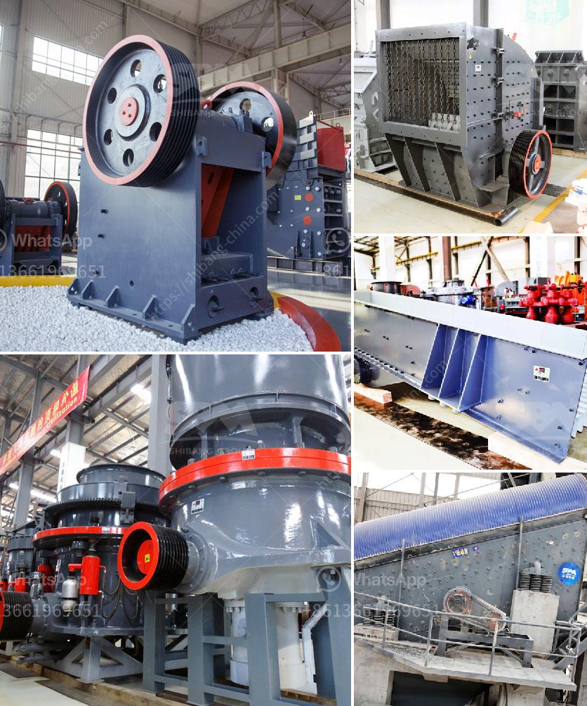

<h3>ballast stone crusher in india</h3>
India, the Stone Crushing Industry sector is estimated to have an annual turnover of Rs. 5000 crore (equivalent to $1 billion) and is therefore an economically important sector. The sector is estimated to be providing direct employment to over 500,000 people engaged in various activities such as mining, crushing plant, transportation of mined stones, and crushed products. These industries are essential for the future development of India.

Ballast stone crusher, also known as stone crushing equipment, is widely used in mining, smelting, building materials, highways, railways, water conservancy and chemical industries. It can crush various kinds of ores and rocks with medium hardness. Ballast stone crusher works in the primary stage and the secondary stage. In the primary stage, it crushes large stones into smaller particles that can be processed by secondary crushers.

India is a country with abundant resources in various types of stone and stone resources are found in large reserves. The aggregate crushing plant can produce all kinds of concrete aggregates for construction, building, road, highway construction industry. Processed materials include crushed limestone, granite, basalt, dolomite, iron ore, and others.

This crushing equipment can be used in many fields, such as construction, mining, metallurgy, and so on. Different industries will have different requirements for the particle size and quality of the finished products. Therefore, it is necessary to select the appropriate crushing equipment based on the requirements of the industry.

Ballast stone crusher plays an important role in the construction of various infrastructures like buildings, roads, railways, airports, water conservancy, and so on. It is widely used in cement, chemical, metallurgy, coal mining, construction, and other industries.

In India, as an economically developed country, the stone crushing industry has an indispensable contribution to economic development. Stone crushing equipment is widely used in the whole process of production line, including the primary crushing stage, secondary crushing stage, and the tertiary crushing stage.

The ballast stone crushing machine price is promoted by various factors. Among them, the cost-effectiveness of the price is bound to be recognized by the vast majority of customers. With the increasing market demand for ballast stone, in addition to the increase in demand for its own needs, there is also an opportunity for cooperation with foreign countries.

India has abundant resources of ballast stone, which can meet the production needs of various industries such as building aggregates, water conservancy, and hydropower, railway construction, and road construction. But how to choose a reliable ballast stone crusher manufacturer?

According to the feedback from the vast number of customers, the user experience went on all day, went to the factory to learn how to buy a good quality ballast stone crusher. It is important to find a reliable stone crusher manufacturer.

As the name suggests, the ballast stone crusher has a simple structure, which saves materials, reduces transportation costs, and has high work efficiency. In addition, the quality of the raw materials is also very important.

Once the quality of the ballast stone crusher is not up to standard, the user's production and profits are also affected. In order to ensure the quality of the ballast stone crusher, the user should consider the manufacturer's reputation, production scale, after-sales service, and other factors.

In conclusion, the ballast stone crusher in India has unique advantages in the market, investment prospects and environmental factors, and has won the favor of various industries. However, due to the harsh working environment of the ballast stone crusher in India, some companies are starting to adapt and cope with the national high-speed material construction needs.
<h3>Contact us</h3><ul><li><strong>Whatsapp:&nbsp;<a href="https://wa.me/8613661969651">+8613661969651</a></strong></li><li><a href="https://swt.shibang-china.com/?git&amp;zhl&amp;ballast stone crusher in india"><strong>Online Service(chat now)</strong></a></li></ul><h3>Related</h3><ul><li><a href='stone crusher price in dubai.md'>stone crusher price in dubai</a></li><li><a href='gypsum powder machine.md'>gypsum powder machine</a></li><li><a href='dental stone jaw crusher.md'>dental stone jaw crusher</a></li><li><a href='cement clinker conveyor belt.md'>cement clinker conveyor belt</a></li><li><a href='belt conveyor continental di indonesia.md'>belt conveyor continental di indonesia</a></li></ul>