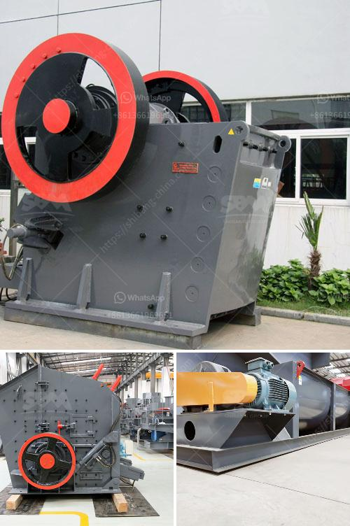

<h3>ballast stone crusher</h3>
Ballast, in all its simplicity and uniqueness, is one of the most sustainable materials used in the railway track construction. This distinctive and sturdy stone plays a vital role in ensuring smooth and safe train operations. In this article, we will explore the various aspects of ballast stone crushers and how they are beneficial in railway track construction.

Ballast stone is a lithological term that refers to a dense variety of aggregate that is predominantly used in railway track construction. Typically, ballast stones are sizeable pieces of crushed rock or gravel that are laid immediately beneath and around the sleepers (ties) or railroad ties. These stones keep the tracks in place by providing stability, reducing track deformation, and distributing loads evenly.

In railway track construction, ballast stone plays a fundamental role in providing strength to the overall structure. The loading of trains on the tracks gradually compresses the ballast stone, ensuring its interlocking and cohesive properties. Additionally, ballast stone crushers help in reducing unnecessary costs and other related complications due to improper track structure.

Ballast stone crushers have numerous benefits when used in railway track construction. It is evident that the proper utilization of ballast stone helps in preserving full functionality of the railway tracks for a long time, thus reducing overall maintenance and repair costs.

Ballast stones act as a stable foundation for the railway tracks, preventing them from sinking into the ground. The stones evenly distribute the weight of the trains passing over them, preventing excessive track deformation. This stability significantly enhances the safety and efficiency of train operations.

Ballast stone crushers play a vital role in maintaining improved drainage on the railway trackbed, ensuring water drains properly and that trackbed remains dry. It helps prevent the accumulation of water and moisture that can otherwise lead to detrimental effects like track erosion and structural instability.

Ballast stones help in reducing the vibrations caused by moving trains, thus minimizing potential damages to nearby structures like bridges and tunnels. Their ability to distribute the load uniformly prevents excessive stress concentration that can lead to cracks and failures.

The durable nature of ballast stones ensures higher resistance to track degradation, maintaining the track geometry and stability for longer durations. This reduces the need for frequent replacements, resulting in cost savings and increased lifespan of the railway tracks.

In conclusion, ballast stone crushers significantly contribute to the overall strength and functionality of railway tracks. Their key benefits include enhanced stability, effective load distribution, efficient drainage, reduced damage to adjacent structures, and improved track durability. By incorporating ballast stone crushers in track construction, railways can ensure sustainable and reliable operations, reducing maintenance and repair costs in the long run.
<h3>Contact us</h3><ul><li><strong>Whatsapp:&nbsp;<a href="https://wa.me/8613661969651">+8613661969651</a></strong></li><li><a href="https://swt.shibang-china.com/?git&amp;zhl&amp;ballast stone crusher"><strong>Online Service(chat now)</strong></a></li></ul><h3>Related</h3><ul><li><a href='marble granite stone grinding machine price.md'>marble granite stone grinding machine price</a></li><li><a href='chrome mining business plan.md'>chrome mining business plan</a></li><li><a href='rock crushers uk.md'>rock crushers uk</a></li><li><a href='production grinding mill europe.md'>production grinding mill europe</a></li><li><a href='fully mobile limestone crusher.md'>fully mobile limestone crusher</a></li></ul>