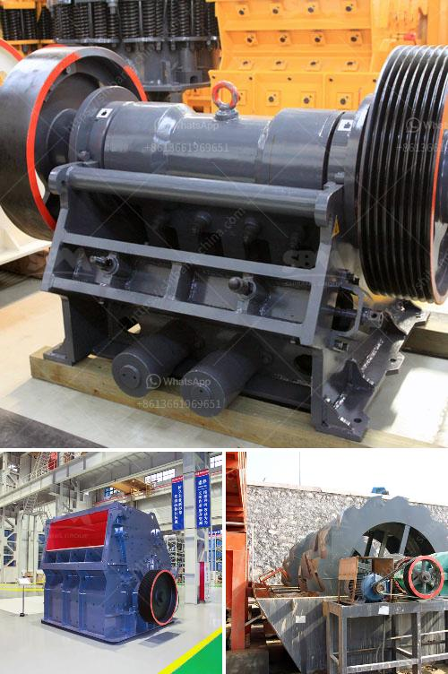

<h3>barite beneficiation plant manufacturers in usa</h3>
Barite is an important industrial mineral used primarily in the oil and gas drilling industry. It is also used in various other sectors such as plastics, paints, rubber, and pharmaceuticals. Barite, commonly referred to as barytes, is naturally occurring and consists of high-density barium sulfate (BaSO4).

To effectively extract and process this valuable mineral, the usage of barite beneficiation plant is imperative. Barite beneficiation plant manufacturers in the United States are actively involved in finding sustainable solutions to tackle critical environmental issues. They are investing in advanced technologies to achieve high-quality standards and expand their production capacities.

One key area of focus is water consumption during the beneficiation process. The beneficiation plant manufacturers are introducing water recycling and treatment systems to minimize freshwater usage. Through innovative water treatment practices, they are able to recycle a significant portion of wastewater generated during the beneficiation process. This not only reduces water consumption but also minimizes the impact on the local water sources.

Additionally, these manufacturers are striving to reduce their carbon footprint by implementing energy-efficient technologies. Various energy-saving measures are being adopted, such as using high-efficiency motors and incorporating waste heat recovery systems. By optimizing energy consumption, these manufacturers not only save costs but also contribute to a greener environment.

Furthermore, these manufacturers are committed to maintaining safety standards and ensuring the well-being of their employees. They prioritize safety training programs, conduct regular safety audits, and enhance safety protocols. By implementing stringent safety measures and following industry best practices, they aim to create a safe working environment for their employees.

In terms of product quality, barite beneficiation plant manufacturers in the USA are investing in advanced technology to achieve consistent and high-quality barite products. They are utilizing state-of-the-art equipment to enhance the grinding and beneficiation processes. This ensures the production of barite products that meet the specific requirements of their customers, such as particle size distribution, purity, and chemical composition.

The beneficiation plant manufacturers are also attentive to the regulations and standards set by various government authorities. They adhere to environmental regulations and take necessary measures to control emissions and manage waste disposal. Additionally, they conduct regular monitoring and testing to ensure compliance with quality standards and specifications.

Furthermore, these manufacturers strive to meet the diverse requirements of their customers in terms of product customization and timely deliveries. They work closely with their clients to understand their specific needs and provide tailored solutions accordingly. Moreover, they maintain an efficient supply chain network to ensure timely delivery of their products to customers within the USA and abroad.

In conclusion, the barite beneficiation plant manufacturers in the USA are focused on finding sustainable solutions to environmental challenges. They are investing in advanced technologies, implementing energy-efficient practices, and recycling water to reduce their environmental impact. These manufacturers are also committed to maintaining safety standards and producing high-quality barite products. With their dedication to sustainability, innovation, and customer satisfaction, they play a vital role in the barite industry and contribute to the overall growth and development of the sector.
<h3>Contact us</h3><ul><li><strong>Whatsapp:&nbsp;<a href="https://wa.me/8613661969651">+8613661969651</a></strong></li><li><a href="https://swt.shibang-china.com/?git&amp;zhl&amp;barite beneficiation plant manufacturers in usa"><strong>Online Service(chat now)</strong></a></li></ul><h3>Related</h3><ul><li><a href='ball mill feed spout seal.md'>ball mill feed spout seal</a></li><li><a href='jaw crushers liners.md'>jaw crushers liners</a></li><li><a href='mobile crushing plant canada.md'>mobile crushing plant canada</a></li><li><a href='iron ore production from chrysotile.md'>iron ore production from chrysotile</a></li><li><a href='manufacturers of conveyor belts.md'>manufacturers of conveyor belts</a></li></ul>