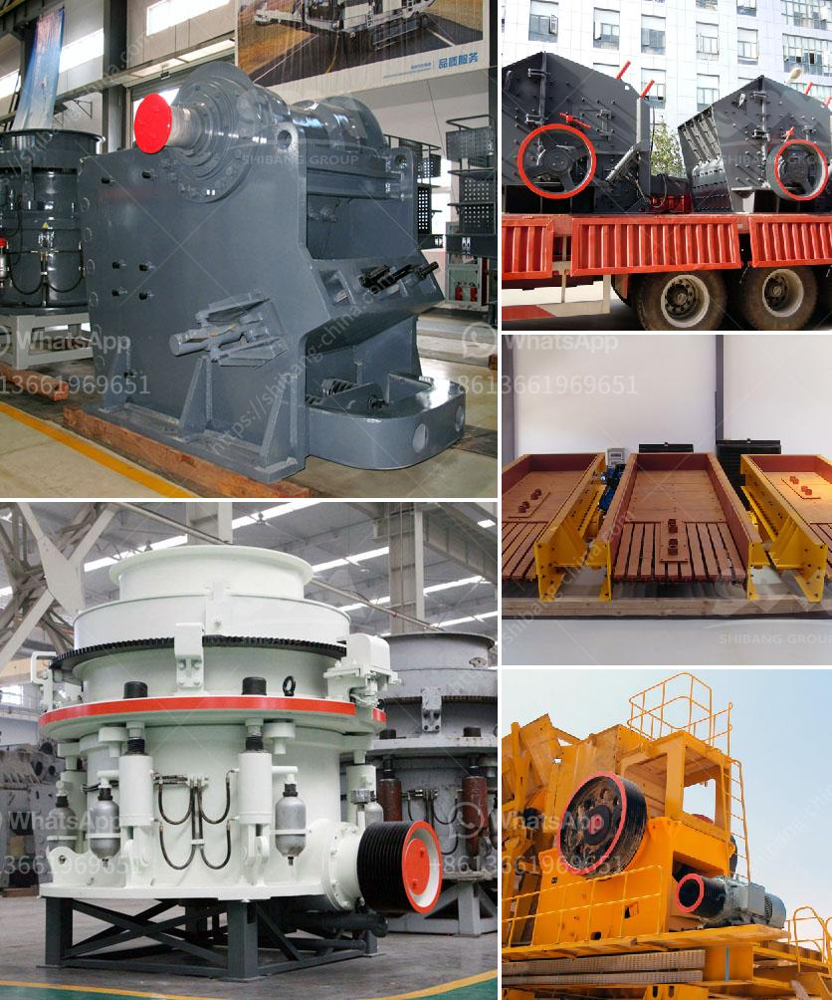

<h3>barite beneficiation</h3>
Barite is a mineral composed of barium sulfate (BaSO4) that is commonly found in a variety of colors, including yellow, brown, white, blue, and grey. It is primarily used in oil and gas drilling as a weighting agent to prevent the formation of fractures during drilling operations. However, barite must go through a beneficiation process to remove impurities and increase its overall quality for commercial use.

The barite beneficiation process involves crushing, screening, and grinding the raw ore to separate it from associated gangue minerals. Then, gravity separation, magnetic separation, flotation, and chemical processing are applied to further remove impurities and improve the barite content.

Gravity separation is often used as the primary beneficiation method to separate barite from gangue minerals due to its low-cost and simple operation. The crushed and ground barite ore is fed into a specific gravity separator, such as a jig machine or a spiral chute, which utilizes the differences in specific gravity between barite and gangue minerals to separate them. The final barite concentrate can then be used for various applications.

Magnetic separation is another method utilized in barite beneficiation, where magnetic separators are used to remove magnetic materials in the ore. This process is particularly useful in cases where iron-bearing minerals are present alongside barite.

Flotation is used to remove impurities, especially silica, from the barite ore. By adding various reagents, such as fatty acids or petroleum sulfonates, to the pulp, the barite particles become hydrophobic and attach to air bubbles, which rise to the surface and are collected as a concentrate.

Chemical processing methods, such as leaching or acid treatment, are sometimes employed to further improve the purity of the barite concentrate obtained from the previous beneficiation steps.

In summary, barite beneficiation is a multi-step process that involves crushing, screening, grinding, gravity separation, magnetic separation, flotation, and chemical processing methods. By removing impurities and increasing the purity and quality of the barite concentrate, it can be used in a wide range of industries besides drilling, including paints, plastics, rubber, and pharmaceuticals. The beneficiation process is essential for maximizing the value and usability of this important mineral resource.
<h3>Contact us</h3><ul><li><strong>Whatsapp:&nbsp;<a href="https://wa.me/8613661969651">+8613661969651</a></strong></li><li><a href="https://swt.shibang-china.com/?git&amp;zhl&amp;barite beneficiation"><strong>Online Service(chat now)</strong></a></li></ul><h3>Related</h3><ul><li><a href='stone crusher pricetonnes capacity per hour.md'>stone crusher pricetonnes capacity per hour</a></li><li><a href='ball mill manufacturer in philippines.md'>ball mill manufacturer in philippines</a></li><li><a href='mobile crushers quarry plant south africa.md'>mobile crushers quarry plant south africa</a></li><li><a href='ball mill operating rpm calculation.md'>ball mill operating rpm calculation</a></li><li><a href='marble powder crusher plant.md'>marble powder crusher plant</a></li></ul>