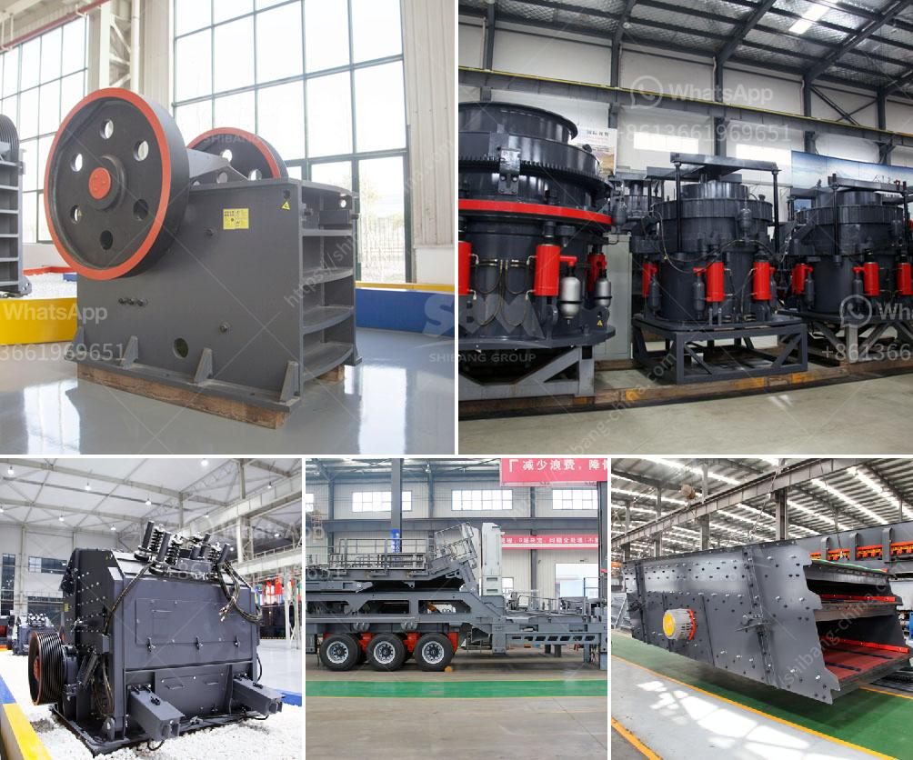

<h3>barite crusher equipment</h3>
Barite, also known as baryte, is a mineral commonly found in sedimentary rocks. It is used as a weighting agent in drilling muds, paints, and plastics, and it is also used in high-density concrete for radiation shielding. Barite is processed into a variety of products, such as grinding mill, crusher equipment, and milling equipment, to meet the needs of different industrial applications.

Barite crushing and grinding equipment is designed to process barite into fine particles, which are suitable for drilling muds, paints, plastics, and other industries. In the barite grinding process, SBM's LM series vertical mill is often used as the barite grinding machine. In addition, it is designed with high-performance separator and optimized airflow ensures high separation efficiency and low pressure loss for energy-saving operation. The tailings are collected and the product is continuously collected.

When it comes to barite crushing equipment, SBM's PE jaw crusher and European type jaw crusher are both suitable. They can meet the requirements of barite crushing process and provide users with efficient and low-cost equipment.

Moreover, the impact crusher and cone crusher can also be used in barite crushing process. According to the application requirements, SBM's VSI crusher, mobile crusher, and portable crusher can be chosen to meet specific user requirements.

In conclusion, barite plays an important role in many industrial applications. The processing of barite requires different types of crushing equipment. With the rapidly development of technology, the crusher equipment has widely used in many industrial sectors such as chemical, construction, ceramics, glass, and so on. Meanwhile, barite crusher equipment has also occupied a significant place in the market. So what are you waiting for? Choose SBM's crushing equipment to process barite efficiently and create more value for yourself and your business.
<h3>Contact us</h3><ul><li><strong>Whatsapp:&nbsp;<a href="https://wa.me/8613661969651">+8613661969651</a></strong></li><li><a href="https://swt.shibang-china.com/?git&amp;zhl&amp;barite crusher equipment"><strong>Online Service(chat now)</strong></a></li></ul><h3>Related</h3><ul><li><a href='limestone handling system scheme with grinding mill.md'>limestone handling system scheme with grinding mill</a></li><li><a href='crushing stones for gold.md'>crushing stones for gold</a></li><li><a href='coal crusher 350tph.md'>coal crusher 350tph</a></li><li><a href='cost of limestone crusher plant.md'>cost of limestone crusher plant</a></li><li><a href='usa used equipment grinding mill 100tph 200 mesh.md'>usa used equipment grinding mill 100tph 200 mesh</a></li></ul>