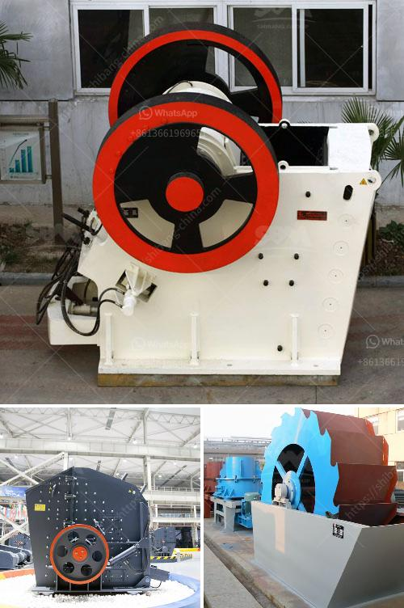

<h3>barite grinding plants in nigeria</h3>
Barite is one of the important industrial minerals used in oil drilling operations as well as other industrial applications. In Nigeria, the mining and production of barite is flourishing. With over 15 million tonnes of barite deposits across the country, the volume of barite available in Nigeria gives the country a competitive edge in the global market.

The booming barite sector is spearheaded by the Nigerian government's decision to fully implement its local content policy. This policy emphasizes the need for mining and processing companies in the country to give priority to the employment of Nigerians and utilize locally-sourced materials and equipment.

As a result, several barite grinding plants have been established in different parts of the country. These plants use equipment such as high-pressure grinding rolls (HPGR) and vertical mills to achieve the desired grinding fineness. Barite grinding plants in Nigeria have the capacity to produce up to 50,000 metric tonnes of various barite powders per annum, and they also process barite to oilfield standard grades.

The international oil companies operating in Nigeria, such as Chevron and ExxonMobil, appreciate the local content policy and actively support local barite miners with purchasing contracts and pre-financing opportunities. This has further boosted the demand for barite grinding plants in the country.

Apart from the oil and gas sector, barite grinding plants are also in high demand in the construction industry, as a drilling fluid additive, and even in medical research. Barite grinding plants play a crucial role in the production and processing of barite and other industrial minerals in Nigeria. They act as intermediaries, ensuring that the final product from the barite mining processes is of high quality and meets international standards.

With the increasing demand for barite in both the domestic and international markets, Nigeria's barite grinding plants are well-positioned to take advantage of the favorable business environment. The development and growth of these plants will further contribute to the country's economic diversification, job creation, and technological advancement.
<h3>Contact us</h3><ul><li><strong>Whatsapp:&nbsp;<a href="https://wa.me/8613661969651">+8613661969651</a></strong></li><li><a href="https://swt.shibang-china.com/?git&amp;zhl&amp;barite grinding plants in nigeria"><strong>Online Service(chat now)</strong></a></li></ul><h3>Related</h3><ul><li><a href='stone crusher machine japan.md'>stone crusher machine japan</a></li><li><a href='ball mills for mining in china.md'>ball mills for mining in china</a></li><li><a href='used cement plants sale germany.md'>used cement plants sale germany</a></li><li><a href='primary crushers.md'>primary crushers</a></li><li><a href='iron separator from steel slag.md'>iron separator from steel slag</a></li></ul>