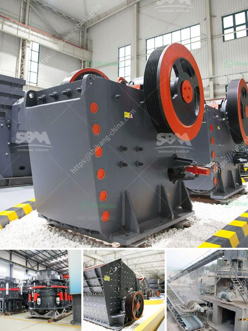

<h3>barite jaw crusher</h3>
Barite, also known as baryte, is a mineral composed mainly of barium sulfate (BaSO4). It is usually colorless or milky white, but can be almost any color, depending on the impurities trapped in the crystals during their formation. Barite is relatively soft, with a Mohs hardness of 3-3.5. It is chemically inert and insoluble in water, making it well-suited for a variety of industrial applications.

One of the primary uses of barite is as a weighting agent in drilling fluids used in the oil and gas industry. When drilling for oil or gas, a dense slurry of barite is pumped into the wellbore to counteract the downward force exerted by the formation fluids. This helps to prevent the well from collapsing and ensures that the drilling mud can circulate properly. Barite also helps to lubricate and cool the drill bit, extending its lifespan.

Another major use of barite is in the production of barium compounds, which have a variety of applications. For example, barium carbonate is used in the production of electromagnetic shielding materials, while barium nitrate is used in fireworks and signal flares. Barite is also used as a filler in various plastics, rubber, and paint formulations due to its high density and chemical inertness.

To meet the growing demand for barite in various industries, efficient crushing equipment is needed. The barite jaw crusher is designed with a V-shaped crushing cavity, feeding port, and discharge port to facilitate efficient crushing of barite materials and reduce dust pollution during the crushing process. The crusher is also equipped with an adjustable discharge port and an automatic iron remover, which can remove impurities such as steel bars and iron blocks in the crushed materials, ensuring the purity of the final product.

In addition, the barite jaw crusher has a high crushing efficiency and a large crushing ratio, which greatly improves the overall processing capacity of the equipment. The overwhelming majority of customers are very satisfied with the performance of the equipment and have given positive feedback. They are particularly impressed by its low energy consumption and high output, which significantly improves their production efficiency and reduces their production costs.

Moreover, the barite jaw crusher is easy to operate and maintain, which not only saves manpower and material resources, but also reduces the downtime of the equipment. The optimized design of the crushing cavity and the movable jaw plate ensures the uniformity of the crushed materials, reduces the occurrence of blockages, and improves the crushing efficiency.

In conclusion, the barite jaw crusher is an indispensable equipment in the barite crushing production line. It not only has a large crushing ratio and high processing capacity, but also has a wide range of applications. It is suitable for crushing various materials with a compressive strength of less than 320 MPa, and it is a cost-effective crushing equipment. With the rapid development of the industrial economy, the demand for barite will continue to grow, and the development of efficient and energy-saving crushing equipment will also flourish.
<h3>Contact us</h3><ul><li><strong>Whatsapp:&nbsp;<a href="https://wa.me/8613661969651">+8613661969651</a></strong></li><li><a href="https://swt.shibang-china.com/?git&amp;zhl&amp;barite jaw crusher"><strong>Online Service(chat now)</strong></a></li></ul><h3>Related</h3><ul><li><a href='ball mills caractecrsistiacs techniques.md'>ball mills caractecrsistiacs techniques</a></li><li><a href='turnkey consultant for calcium carbonate plant in india.md'>turnkey consultant for calcium carbonate plant in india</a></li><li><a href='china silica sand vibrating screen.md'>china silica sand vibrating screen</a></li><li><a href='ball mills for measured mining.md'>ball mills for measured mining</a></li><li><a href='industrial impact crusher.md'>industrial impact crusher</a></li></ul>