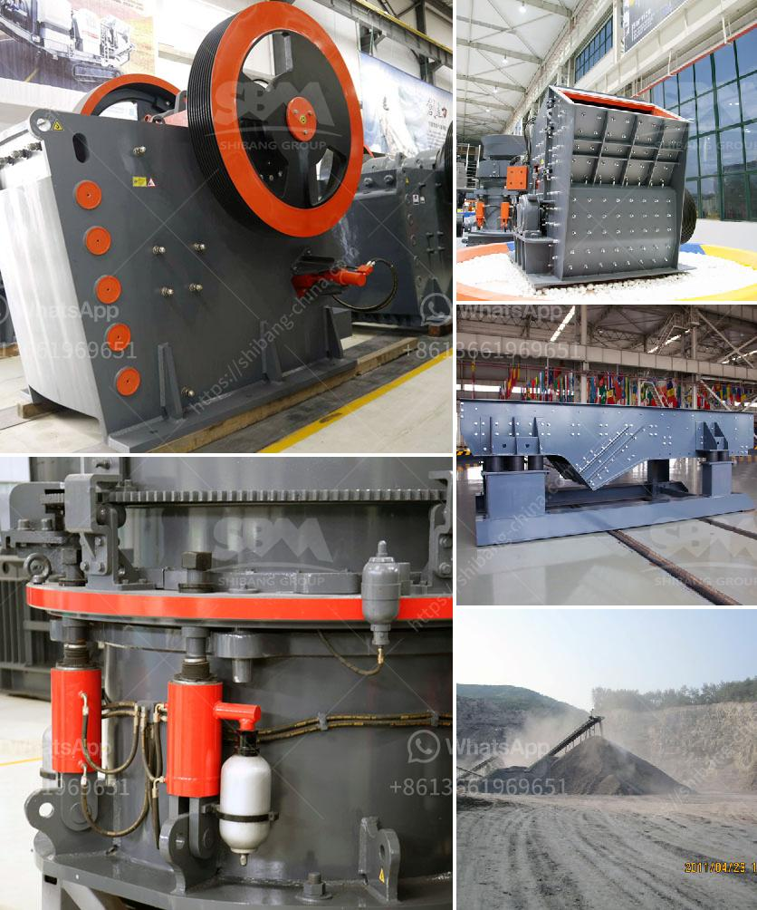

<h3>barite machinery production plant</h3>
The demand for barite, also known as barytes or heavy spar, has been growing steadily in various industries such as oil and gas, paint and coatings, pharmaceuticals, and construction. This mineral is primarily used as a weighting agent in drilling fluids in the oil and gas industry and as a filler in various products. To meet the growing demand, barite machinery production plants play a crucial role in extracting, processing, and refining this precious mineral for commercial use.

Barite machinery production plants are state-of-the-art facilities equipped with advanced technology and machinery to ensure efficient and high-quality production. These plants typically consist of several key components, including crushers, mills, screening equipment, and drying units, to facilitate the entire process from raw material extraction to final product packaging.

The first step in barite production is mining, where barite deposits are extracted from the earth's crust. Conventional mining techniques, such as open-pit or underground mining, are employed depending on the location and depth of the deposit. Once the barite ore is extracted, it is transported to the processing plant for further refinement.

In the processing plant, the extracted barite undergoes several stages of crushing, milling, and screening to obtain the desired particle size distribution. Crushers reduce the size of the extracted ore, making it easier to handle and process. Subsequently, the crushed ore is milled to produce a fine powder suitable for various applications. The milling process involves using specialized equipment, such as ball mills or vertical roller mills, to further grind the barite particles to the desired fineness.

After milling, the barite undergoes screening, where different sizes of particles are separated to meet individual customer requirements. Screening equipment, such as vibrating screens or shale shakers, are used to achieve this separation. Furthermore, drying units may also be employed to remove moisture and improve the handling and storage properties of the final product.

The final product is then packaged and prepared for distribution. Barite is commonly supplied in bulk or in bags, depending on customer specifications. Packaging and labeling are important considerations to ensure safe transportation and convenient handling at the end-user's facility.

Barite machinery production plants are strategically located near major barite deposits worldwide. This allows for efficient access to raw materials and reduces transportation costs, as barite is typically a heavy mineral. Moreover, the proximity to customers in various industries ensures timely delivery and customer satisfaction.

In recent years, barite machinery production plants have been adopting environmentally friendly practices to minimize their ecological footprint. Such practices include energy-efficient machinery, waste management systems, and water recycling to conserve natural resources.

In conclusion, barite machinery production plants are essential for meeting the growing demand for this versatile mineral. These plants employ advanced technology and machinery for efficient extraction, processing, and refinement of barite, ensuring a high-quality end product. As barite continues to play a vital role in numerous industries, the importance of these production plants cannot be overstated. They enable the supply of barite to meet the diverse needs of industries worldwide while maintaining environmental sustainability.
<h3>Contact us</h3><ul><li><strong>Whatsapp:&nbsp;<a href="https://wa.me/8613661969651">+8613661969651</a></strong></li><li><a href="https://swt.shibang-china.com/?git&amp;zhl&amp;barite machinery production plant"><strong>Online Service(chat now)</strong></a></li></ul><h3>Related</h3><ul><li><a href='stone paper production process.md'>stone paper production process</a></li><li><a href='cone crusher price in china.md'>cone crusher price in china</a></li><li><a href='limestone crushing and screening.md'>limestone crushing and screening</a></li><li><a href='chromite crushing plant in karachi pakistan sale.md'>chromite crushing plant in karachi pakistan sale</a></li><li><a href='rent a rock crusher saudi.md'>rent a rock crusher saudi</a></li></ul>