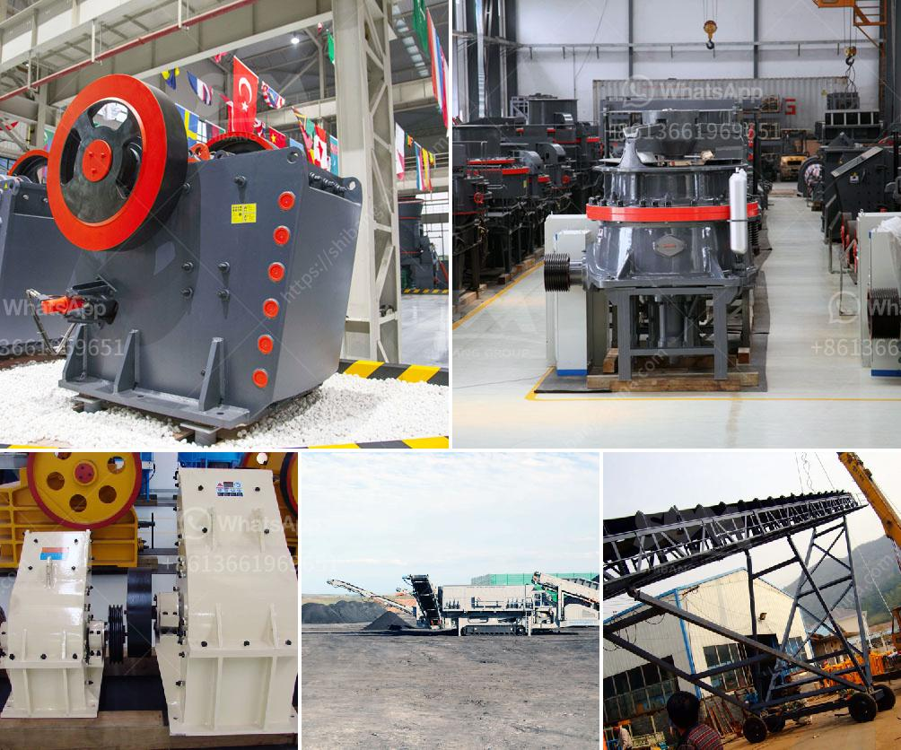

<h3>barium carbonate manufacturing process</h3>
Barium carbonate is a white, odorless powder commonly used in the manufacturing industry for various applications. It is primarily used in the production of ceramics, glass, and barium ferrite magnets. Barium carbonate is also utilized in the production of other barium compounds, pigments, and as a rat poison. In this article, we will explore the manufacturing process of barium carbonate.

The manufacturing of barium carbonate begins with the mining of barite ore, which is the primary source of barium. Barite ore is typically found in sedimentary rocks and is extracted using mining techniques such as open-pit or underground mining. Once the ore is extracted, it is then crushed and ground to a fine powder.

The next step in the manufacturing process is the purification of the barite ore. The crushed and ground powder is washed to remove impurities, such as silica and iron oxide, which can negatively impact the quality of the final product. This purification process ensures that the barium carbonate produced is of high purity.

After purification, the barite ore undergoes further processing to convert it into barium sulfide. This process involves heating the purified barium sulfate with carbon in a rotary kiln at high temperatures. The carbon reacts with the barium sulfate to form barium sulfide and carbon dioxide gas.

Once the barium sulfide is obtained, it is then subjected to further chemical reactions to produce barium carbonate. The barium sulfide is first dissolved in water, forming a solution. Carbon dioxide gas is then bubbled through the solution, causing a precipitation reaction to occur. The barium sulfide reacts with carbon dioxide to form barium carbonate and hydrogen sulfide gas.

The barium carbonate obtained from the precipitation reaction is then filtered, washed with water to remove impurities, and dried. The drying process ensures that the barium carbonate is in a powdered form, ready for further processing or packaging.

Barium carbonate manufacturing processes often involve the use of chemicals and require careful handling to ensure worker safety and environmental protection. Industries that manufacture barium carbonate must adhere to strict quality control measures to ensure that the final product meets the desired specifications. Regular testing and monitoring of the manufacturing process are conducted to maintain consistency in product quality.

In conclusion, the manufacturing process of barium carbonate involves several steps, starting from the extraction and purification of barite ore to the conversion of barium sulfide into barium carbonate. This process requires careful handling, adherence to safety protocols, and quality control measures to produce a high-quality product. Barium carbonate is an essential ingredient in various industries, and with continued advancements in manufacturing technology, the production of barium carbonate is expected to become more efficient and environmentally friendly.
<h3>Contact us</h3><ul><li><strong>Whatsapp:&nbsp;<a href="https://wa.me/8613661969651">+8613661969651</a></strong></li><li><a href="https://swt.shibang-china.com/?git&amp;zhl&amp;barium carbonate manufacturing process"><strong>Online Service(chat now)</strong></a></li></ul><h3>Related</h3><ul><li><a href='terrex stone crushers in usa.md'>terrex stone crushers in usa</a></li><li><a href='quote for vsi crusher.md'>quote for vsi crusher</a></li><li><a href='changsha kaiyuan coal crusher.md'>changsha kaiyuan coal crusher</a></li><li><a href='stone crushers from china.md'>stone crushers from china</a></li><li><a href='quartz powder ball mill in tamilnadu.md'>quartz powder ball mill in tamilnadu</a></li></ul>