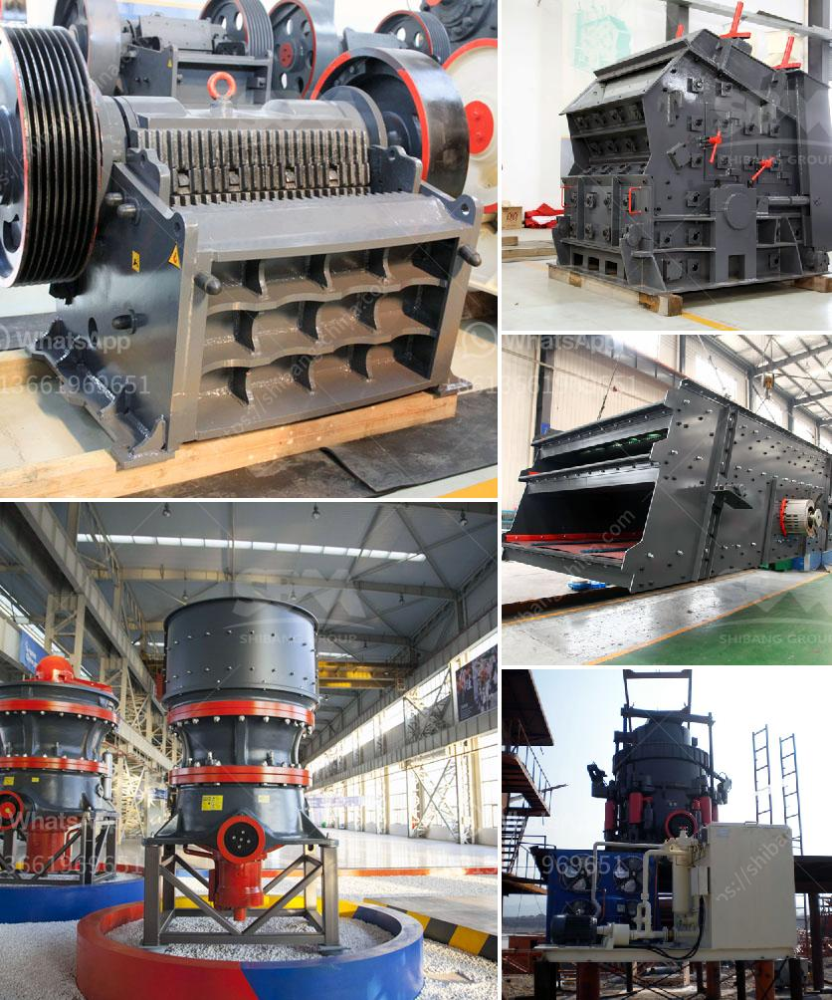

<h3>basalt manufacturer crusher machine</h3>
The basalt manufacturer crusher machine is a highly efficient piece of equipment that helps in breaking down large rocks into smaller components for various construction and mining projects. It is commonly used in basalt excavation sites to ensure uniformity in size and shape of the crushed basalt rocks.

One of the key advantages of the basalt manufacturer crusher machine is its ability to produce precise and even-sized materials. Unlike traditional crushers, this unique machine crushes rocks using a mechanical pressure method rather than relying on impact or grinding forces. The result is a uniform and consistent product that can be used directly in various applications without the need for additional processing.

The basalt manufacturer crusher machine is equipped with a powerful motor that is capable of generating high-quality crushing force. This ensures that the rocks are efficiently broken down into smaller pieces, making the process faster and more efficient. The machine also comes with a hydraulic system that allows for easy adjustment of the crushing size, ensuring that it meets the specific requirements of each project.

Another notable feature of the basalt manufacturer crusher machine is its durability and long lifespan. Made from high-quality materials, such as hardened steel, the machine is designed to withstand heavy use and harsh working conditions. It is capable of crushing even the toughest rocks, including basalt, granite, and other hard and abrasive materials, without losing its efficiency or performance.

The basalt manufacturer crusher machine is also designed with safety in mind. It comes with various safety features, such as a safety guard and emergency stop button, to prevent accidents and injuries during the crushing process. The machine is also easy to operate, with user-friendly controls that require minimal training and experience.

In addition to its durability and safety features, the basalt manufacturer crusher machine is also highly versatile. It can be used in a wide range of applications, including construction, road building, mining, and more. It can crush basalt rocks into various sizes, depending on the specific requirements of each project. The machine can also be easily transported and set up at different job sites, making it highly convenient for on-site crushing operations.

Overall, the basalt manufacturer crusher machine is a reliable and efficient piece of equipment that offers numerous benefits for construction and mining projects. Its ability to produce precise and even-sized materials, along with its durability and safety features, make it a valuable asset for any basalt excavation site. With its versatility, it can cater to various project requirements and provide high-quality crushed basalt rocks for a wide range of applications.
<h3>Contact us</h3><ul><li><strong>Whatsapp:&nbsp;<a href="https://wa.me/8613661969651">+8613661969651</a></strong></li><li><a href="https://swt.shibang-china.com/?git&amp;zhl&amp;basalt manufacturer crusher machine"><strong>Online Service(chat now)</strong></a></li></ul><h3>Related</h3><ul><li><a href='buy sand washing plant in sri lanka.md'>buy sand washing plant in sri lanka</a></li><li><a href='granite and marble business plan pdf.md'>granite and marble business plan pdf</a></li><li><a href='manufacture of ball mill stator.md'>manufacture of ball mill stator</a></li><li><a href='cone crusher price in china.md'>cone crusher price in china</a></li><li><a href='the production process of cobblestone.md'>the production process of cobblestone</a></li></ul>