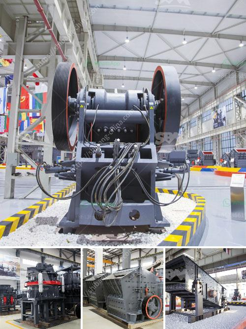

<h3>basalt production equipment</h3>
Basalt is a common volcanic rock found all over the world. It is formed when magma erupts from a volcano and cools rapidly. The resulting rock is dense and durable, making it an ideal material for a variety of applications, including construction, landscaping, and paving.

In order to utilize basalt, it needs to be processed into smaller pieces that can be used for different purposes. This is where basalt production equipment comes into play. Basalt production equipment is used to process large chunks of basalt into smaller pieces suitable for use in various industries.

There are several different types of equipment that can be used for this purpose, including jaw crushers, impact crushers, cone crushers, and grinding mills. Each type of equipment has its own specific function and is designed to process basalt in a particular way.

Jaw crushers are commonly used in basalt production as they can handle large pieces of basalt. The material is fed into the jaw crusher, where it is crushed down into smaller pieces. From there, it can be further processed into different sizes or used as is, depending on the application.

Impact crushers are another commonly used piece of equipment in basalt production. These crushers use a high-speed rotor to break the basalt into smaller pieces. The rotor spins at a high velocity, causing the material to be shattered upon impact. This type of equipment is particularly useful for producing fine-grained basalt that can be used in concrete or asphalt production.

Cone crushers are similar to jaw crushers in that they also crush basalt by applying pressure between a fixed and a moving surface. However, cone crushers are more versatile and can be used for both primary and secondary crushing. They are also capable of producing different sizes of basalt, depending on the desired end product.

Grinding mills are used for the final processing of basalt, turning it into a fine powder that can be used in a variety of applications. These mills use a combination of crushing and grinding to break down the basalt into smaller particles. The resulting powder can be used in manufacturing cement, ceramics, or as a soil amendment.

In conclusion, basalt production equipment is essential in the processing of basalt into usable products. The different types of equipment, including jaw crushers, impact crushers, cone crushers, and grinding mills, each play a specific role in the production process. By using this equipment, basalt can be transformed into various sizes and forms to meet the needs of different industries. Whether it is used in construction, landscaping, or manufacturing, basalt is a versatile material that can be found in many everyday products.
<h3>Contact us</h3><ul><li><strong>Whatsapp:&nbsp;<a href="https://wa.me/8613661969651">+8613661969651</a></strong></li><li><a href="https://swt.shibang-china.com/?git&amp;zhl&amp;basalt production equipment"><strong>Online Service(chat now)</strong></a></li></ul><h3>Related</h3><ul><li><a href='crusher santa marta malaysia.md'>crusher santa marta malaysia</a></li><li><a href='gold processing leaching plant.md'>gold processing leaching plant</a></li><li><a href='impact crusher equipment manufacturer.md'>impact crusher equipment manufacturer</a></li><li><a href='granite quarry machinery from turkey.md'>granite quarry machinery from turkey</a></li><li><a href='stone crusher machine price in south africa.md'>stone crusher machine price in south africa</a></li></ul>