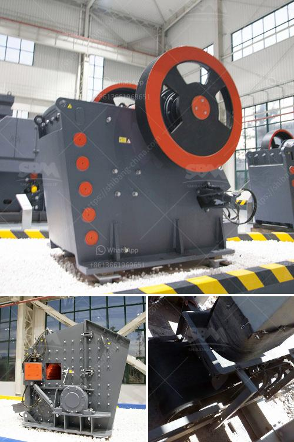

<h3>basic machines used stone crusher</h3>
A stone crusher is a machine designed to reduce large rocks into smaller rocks, gravel, or rock dust. Crushers may be used to reduce the size, or change the form, of waste materials so they can be more easily disposed of or recycled, or to reduce the size of a solid mix of raw materials (such as in rock ore), so that pieces of different composition can be differentiated. Crushing is the process of transferring a force amplified by mechanical advantage through a material made of molecules that bond together more strongly, and resist deformation more, than those in the material being crushed do.

Crushing devices hold material between two parallel or tangent solid surfaces, and apply sufficient force to bring the surfaces together to generate enough energy within the material being crushed so that its molecules separate from (fracturing), or change alignment in relation to (deformation), each other. The earliest crushers were hand-held stones, where the weight of the stone provided a boost to muscle power, used against a stone anvil. Querns and mortars are types of these crushing devices.

The stone crusher is one such industry that exists in the vicinity of almost all major cities/towns throughout the country in all the states because the construction activities go on throughout the country. As transportation of stone over long distances adds to cost of the crushed stone products, the crushers need to be necessarily located nearer to the demand centers such as Cities, Bridges, Canals, etc. Stone Crushers also need electricity supply and large number of manpower for its operation. It also needs access roads for the movement of mined stone as well as crushed stone products. It is for these reason that most Stone Crushers are located along the periphery of Cities or in the vicinity of major construction projects.

In most cases, the Stone Crushers come up in clusters of number of units ranging from five to fifty in one cluster. The crushers are located nearer to the source of raw material such as Stone mines, River Beds etc. These stone crushers though socio-economically an important sector, gives rise to substantial quantity of fine fugitive dust emissions which create health hazards to the workers as well as surrounding population by way of causing respiratory diseases.

The dust also adversely affects visibility, reduces growth of vegetation and hampers aesthetics of the area. Stone crushing units are not stand alone crushing units, but stone mining is also associated with this activity; in fact stone mining is the primary and basic activity for the stone crushing units. Therefore this kind of industrial units need scrutiny while granting permission for environmental and mining operations, especially at the time of renewal of the mining lease.

A stone crusher is made up of several different parts. Each part is necessary in order to complete the job. For example, a hopper allows the raw material to be dumped into the machine. The material travels over a feeder, allowing it to be crushed into finer particles. A conveyor belt takes the particles that have been crushed, and sizes them for distribution. Different crushers are used depending on the type of material being crushed.

In conclusion, basic machines such as crushers are necessary in the construction industry. They allow for the crushing of rocks into gravel, smaller rocks, or even dust. They can be used for various purposes such as road building, landscaping, demolition, or recycling. Regardless of the specific use, a stone crusher is a must-have for any construction site or project.
<h3>Contact us</h3><ul><li><strong>Whatsapp:&nbsp;<a href="https://wa.me/8613661969651">+8613661969651</a></strong></li><li><a href="https://swt.shibang-china.com/?git&amp;zhl&amp;basic machines used stone crusher"><strong>Online Service(chat now)</strong></a></li></ul><h3>Related</h3><ul><li><a href='ballast stone crusher in india.md'>ballast stone crusher in india</a></li><li><a href='vibrating feeder for jaw crusher.md'>vibrating feeder for jaw crusher</a></li><li><a href='which way should the ball mill rotate.md'>which way should the ball mill rotate</a></li><li><a href='crusher equipment dubai.md'>crusher equipment dubai</a></li><li><a href='hammer mill stone crusher.md'>hammer mill stone crusher</a></li></ul>