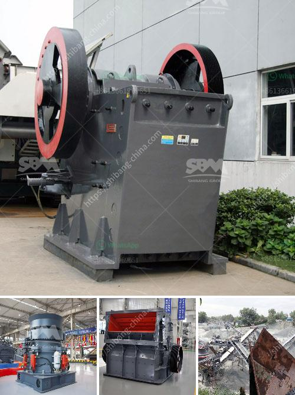

<h3>bauxite beneficiation plant</h3>
Bauxite beneficiation plant is a topic of interest for many countries and regions, including China, the United States, Saudi Arabia, Australia, Ghana, Russia, and Indonesia. The primary steps in the beneficiation process include breaking the raw material in the desired size, classification, washing, and separation. The aim of the beneficiation process is to improve the quality and purity of bauxite ore, which can be used for various purposes such as alumina production, aluminum smelting, and refractory applications.

Bauxite, an aluminum ore, is the world's main source of aluminum. It typically consists of a mixture of minerals, including gibbsite, boehmite, and diaspore, along with impurities such as silica, iron oxide, and titania. The quality and composition of bauxite ore vary depending on the location of the deposits. Therefore, beneficiation plants need to process different types of bauxite ores to meet the specific requirements of downstream industries.

One of the primary objectives of bauxite beneficiation is to reduce the silica content in the ore. Silica is an impurity that lowers the alumina content and causes various operational issues in the production of alumina and aluminum. The beneficiation process utilizes different techniques, such as washing, flotation, magnetic separation, and gravity separation, to remove silica from the ore.

Washing is a common method used to remove clay and fine particles from the bauxite ore. The washed ore is then further screened to remove oversized material and sent to the precipitation area for settling and solid-liquid separation. The settled solids are dewatered, while the clarified liquid is recycled for reuse in the process.

Flotation is another technique used in bauxite beneficiation plants to separate the desired minerals from the gangue. In this process, a chemical reagent is added to the ore slurry to selectively float the desired minerals while leaving the gangue behind. The floated minerals are then collected and dewatered to obtain the final product.

Magnetic separation is primarily used to remove iron-bearing minerals from the bauxite ore. This technique utilizes magnetic separators to attract and separate magnetic minerals from non-magnetic ones. The magnetic fraction is then further processed to obtain a high-grade iron concentrate.

Gravity separation is employed to separate the heavier minerals, such as hematite, from the lighter gangue minerals. This method relies on the difference in specific gravity between the minerals. The heavier fraction is collected as the concentrate, while the lighter fraction is discarded as tailings.

The beneficiation process not only improves the quality and purity of bauxite ore but also reduces its environmental impact. By removing impurities, the downstream processing plants can achieve higher efficiency and productivity. Moreover, the reduced silica content in bauxite ore leads to less waste generation and lower greenhouse gas emissions during the alumina production process.

In conclusion, bauxite beneficiation plants play a crucial role in the aluminum industry's supply chain. The beneficiation process involves various techniques such as washing, flotation, magnetic separation, and gravity separation to improve the quality and purity of bauxite ore. By reducing impurities, the beneficiation process enhances the efficiency and sustainability of downstream processing plants.
<h3>Contact us</h3><ul><li><strong>Whatsapp:&nbsp;<a href="https://wa.me/8613661969651">+8613661969651</a></strong></li><li><a href="https://swt.shibang-china.com/?git&amp;zhl&amp;bauxite beneficiation plant"><strong>Online Service(chat now)</strong></a></li></ul><h3>Related</h3><ul><li><a href='stone crusher for agriculture.md'>stone crusher for agriculture</a></li><li><a href='concrete crusher machine for sale.md'>concrete crusher machine for sale</a></li><li><a href='clay vibrating screen.md'>clay vibrating screen</a></li><li><a href='mobile chrushers south africa.md'>mobile chrushers south africa</a></li><li><a href='granite quarry crusher equipment.md'>granite quarry crusher equipment</a></li></ul>