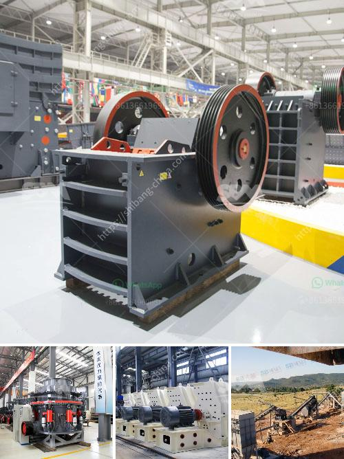

<h3>bauxite crusher manufacturer</h3>
Bauxite is the ideal raw material for producing aluminum metal, which is also the main application of bauxite. It has a high hardness, good wear resistance, and strong chemical stability. Therefore, it is widely used in metallurgical industry, national defense, industry, automotive industry, electrical industry, machinery industry, and civil and construction sectors.

To efficiently process bauxite, the first step is to crush it into smaller sizes. As a professional manufacturer of crushing equipment, SBM, a bauxite crusher manufacturer, has been focusing on the design and development of bauxite crusher for years. SBM experts can customize solutions based on customers' requirements and provide comprehensive pre-sales, in-sales, and after-sales services.

There are several types of bauxite crushers used in the market. SBM's bauxite crushing equipment includes jaw crusher, impact crusher, cone crusher, and VSI crusher. Each crusher has its advantages and disadvantages, but SBM's advanced crushing technology and quality materials have greatly improved the overall performance of the equipment.

Jaw crusher is the most widely used crushing equipment in the bauxite processing market. With the advantages of high crushing ratio, high output, and good particle size, jaw crusher has a good market prospect. At present, the jaw crusher produced by SBM has been widely used in the production of sand and gravel aggregates, and its performance has reached the international level. It is the preferred equipment for crushing bauxite.

Impact crusher is used in the secondary crushing process of bauxite. The feed size is usually between 200-300mm, which is directly processed by the impact crusher for medium and fine crushing. The processed products are mostly used as raw materials for refractory materials, cement, and building materials. Compared with jaw crusher, impact crusher has lower investment cost, higher output, and better grain shape, which is favored by customers.

Cone crusher is used in the fine crushing process of bauxite. The processed bauxite ore particles have uniform particle size and high purity, which is conducive to the production of high-quality aluminum products. Cone crusher plays an important role in the bauxite crushing plant.

VSI crusher is a machine that produces high-quality artificial sand from bauxite. It converts bauxite into sand that can be used for construction purposes. VSI crusher utilizes rock-on-rock crushing principle, which ensures the optimal particle shape and reduces the wear costs significantly. Moreover, VSI crusher has higher crushing efficiency and lower power consumption.

As a bauxite crusher manufacturer, SBM has a full range of crushing equipment for different processing needs. Whether it is jaw crusher, impact crusher, cone crusher, or VSI crusher, SBM provides high-quality equipment and technical support to ensure that customers can safely complete the production of bauxite. SBM's crushers are designed to be reliable, energy-efficient, and durable, making them the best choice for bauxite crushing.
<h3>Contact us</h3><ul><li><strong>Whatsapp:&nbsp;<a href="https://wa.me/8613661969651">+8613661969651</a></strong></li><li><a href="https://swt.shibang-china.com/?git&amp;zhl&amp;bauxite crusher manufacturer"><strong>Online Service(chat now)</strong></a></li></ul><h3>Related</h3><ul><li><a href='kaolin crusher price.md'>kaolin crusher price</a></li><li><a href='25 used crushing machine price.md'>25 used crushing machine price</a></li><li><a href='used silica crushing plants for sale.md'>used silica crushing plants for sale</a></li><li><a href='stone crusher to buy in bangalore.md'>stone crusher to buy in bangalore</a></li><li><a href='cement plant equipment from china.md'>cement plant equipment from china</a></li></ul>