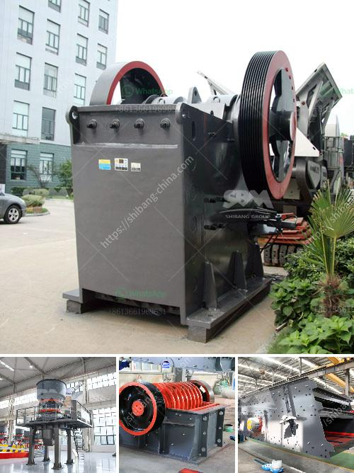

<h3>bauxite ore processing equipment price</h3>
Bauxite ore, the world’s primary source of aluminum, is a widespread mineral known for its high aluminum content. It is used in various industries around the globe, making it a highly sought-after resource. However, before it can be used to produce aluminum, bauxite ore must undergo a complex and intricate processing process that requires specialized equipment.

The first step in bauxite ore processing is the extraction of aluminum oxide, or alumina, from the ore. This is achieved through a chemical process known as the Bayer process, which involves crushing the bauxite ore and dissolving it in a solution of sodium hydroxide. The resulting solution undergoes a series of chemical reactions to separate the alumina from impurities such as iron oxides and silicates.

To carry out the Bayer process efficiently, several types of equipment are required. Crushers and grinders are used to reduce the size of the bauxite ore to facilitate its dissolution in the sodium hydroxide solution. These machines are available in a range of sizes and capacities, depending on the scale of the operation. Larger crushers are typically used in industrial-scale bauxite processing plants, while smaller ones are suited for smaller operations.

After the ore has been crushed and ground, it is mixed with the sodium hydroxide solution in large tanks called digesters. These tanks are typically made of stainless steel and can hold thousands of gallons of bauxite slurry. Various types of agitators ensure proper mixing and create a homogenous solution. The temperature and pressure within the digesters are carefully controlled to optimize the efficiency of the chemical reactions.

Once the alumina has been extracted from the bauxite ore, it is further processed to produce aluminum metal. This is achieved through a process called electrolysis, in which the alumina is dissolved in a molten cryolite bath and subjected to an electric current. The aluminum metal collects at the cathode and is then extracted.

The equipment required for the electrolysis process includes large metal pots called cells, where the aluminum is produced. These cells are usually made of graphite, as it is an excellent conductor of electricity. They are arranged in a series with anodes and cathodes alternately placed in each cell. Electrical connections are made to each anode and cathode to complete the circuit and allow the flow of electricity.

The price of bauxite ore processing equipment can vary depending on the size and capacity of the equipment, as well as the specific requirements of the processing plant. Companies specializing in the production of bauxite ore processing equipment often offer competitive prices based on the market demand and the estimated production capacity.

In conclusion, bauxite ore processing equipment plays a vital role in the aluminum production process. Its specialized machinery is required to efficiently extract alumina from the ore and subsequently produce high-quality aluminum. The price of this equipment can vary depending on various factors, but it is an essential investment for any company involved in bauxite ore processing.
<h3>Contact us</h3><ul><li><strong>Whatsapp:&nbsp;<a href="https://wa.me/8613661969651">+8613661969651</a></strong></li><li><a href="https://swt.shibang-china.com/?git&amp;zhl&amp;bauxite ore processing equipment price"><strong>Online Service(chat now)</strong></a></li></ul><h3>Related</h3><ul><li><a href='crusher machine for hardened powder.md'>crusher machine for hardened powder</a></li><li><a href='copper ore mining for sale in philippines.md'>copper ore mining for sale in philippines</a></li><li><a href='used sand mobile washing equipment.md'>used sand mobile washing equipment</a></li><li><a href='feldspar crusher manufacturer.md'>feldspar crusher manufacturer</a></li><li><a href='stone crusher discount.md'>stone crusher discount</a></li></ul>