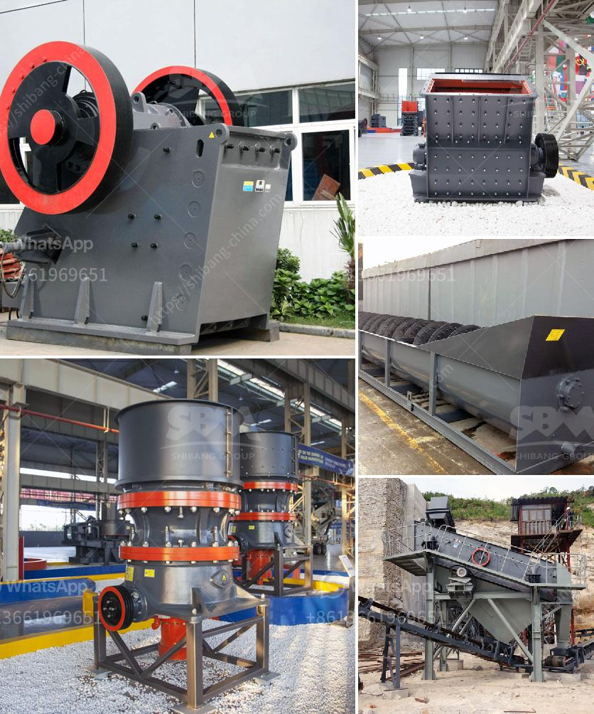

<h3>bauxite plant in dubai</h3>
Dubai, known for its groundbreaking architectural marvels and ambitious projects, has yet again set another milestone with the inauguration of its state-of-the-art Bauxite Plant. Nestled amidst the stunning landscape of the city, the plant stands as a testament to Dubai's commitment to sustainable development and responsible industrial practices.

Bauxite, an essential component in the production of aluminum, is found in abundance in several regions across the globe. However, with the increasing demand for aluminum goods comes the challenge of sourcing bauxite sustainably. This is where the Dubai Bauxite Plant plays a crucial role, as it ensures a reliable supply of ethically-sourced bauxite while minimizing its environmental impact.

One of the key features of the plant is its cutting-edge technology that effectively reduces energy consumption. By utilizing innovative techniques, the plant significantly decreases greenhouse gas emissions, contributing to a healthier and cleaner environment. In addition to this, the facility also utilizes water recycling systems, ensuring responsible water consumption and conservation.

Furthermore, the Bauxite Plant in Dubai emphasizes social responsibility by providing employment opportunities to local communities. The project has generated numerous jobs, benefiting the region's economy and fostering sustainable growth. Dubai's commitment to inclusivity extends beyond employment, as the plant actively engages with nearby communities, organizing educational programs and initiatives to raise awareness about sustainable practices.

The Bauxite Plant in Dubai serves as an exemplar for other industrial developments worldwide. It demonstrates that ambitious projects can coexist harmoniously with nature, prioritizing environmental conservation and sustainable growth. This project echoes Dubai's dedication to the United Nations Sustainable Development Goals, particularly goal number 9, which focuses on building resilient infrastructure, promoting inclusive and sustainable industrialization, and fostering innovation.

In conclusion, the Bauxite Plant in Dubai stands tall as a remarkable achievement in sustainable development. With its advanced technologies, eco-friendly practices, and dedication to local communities, the plant exemplifies Dubai's commitment to responsible industrialization. As the city continues to push boundaries and redefine the limits of human achievement, the Bauxite Plant serves as a shining example of how to pursue progress while safeguarding our planet for future generations.
<h3>Contact us</h3><ul><li><strong>Whatsapp:&nbsp;<a href="https://wa.me/8613661969651">+8613661969651</a></strong></li><li><a href="https://swt.shibang-china.com/?git&amp;zhl&amp;bauxite plant in dubai"><strong>Online Service(chat now)</strong></a></li></ul><h3>Related</h3><ul><li><a href='mineral that is used to make talcum powder.md'>mineral that is used to make talcum powder</a></li><li><a href='primary crushers.md'>primary crushers</a></li><li><a href='stone crusher machine in south africa.md'>stone crusher machine in south africa</a></li><li><a href='buy crusher of jaw.md'>buy crusher of jaw</a></li><li><a href='crusher concrete and stone.md'>crusher concrete and stone</a></li></ul>