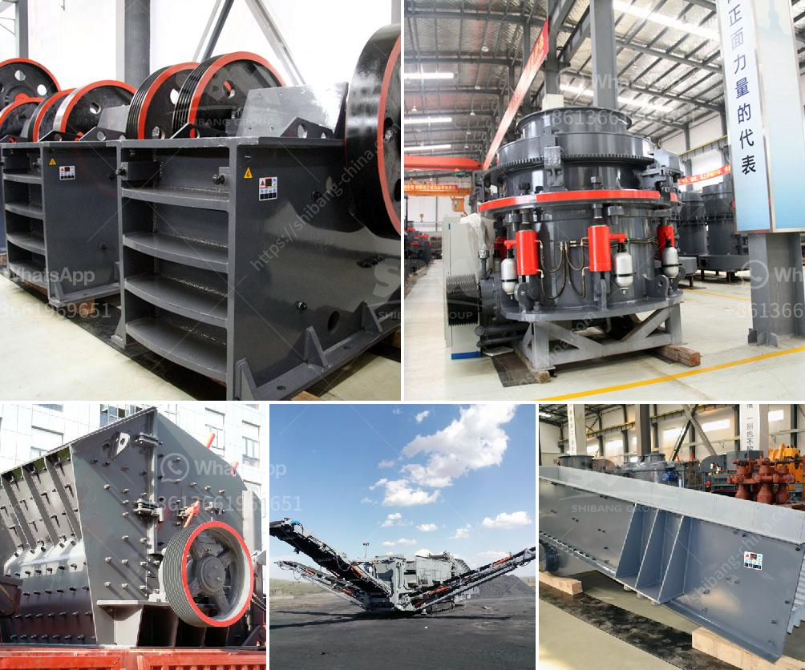

<h3>bauxite processing plant kenya</h3>
Bauxite is a common raw material used in the aluminum industry. It consists mainly of the minerals gibbsite (Al(OH)3), boehmite (γ-AlO(OH)), and diaspore (α-AlO(OH)), mixed with iron oxides and clay minerals. Bauxite deposits are found in many countries, including Kenya, where mining and processing of this ore contribute immensely to the economy.

Kenya has abundant bauxite deposits, mainly in the coastal regions of Mombasa, Kwale, and Kilifi. The deposits are believed to be millions of years old and were formed from the weathering of volcanic rocks. Bauxite mining in Kenya is mainly carried out through open-cast mining methods.

To facilitate the extraction of bauxite, the ore is crushed, screened, and washed before being further processed at a processing plant. Bauxite processing plants are currently found in Mombasa, Kwale, and Kilifi counties. These plants are designed to cater to both the local and international markets.

The processing plants in Kenya offer an opportunity for both employment and economic growth. Job opportunities are created for skilled and unskilled labor in the mining and processing activities. This helps alleviate unemployment rates in the region and improves the living conditions of the local communities.

The bauxite processing plants in Kenya have state-of-the-art equipment and technology for the crushing, screening, and grinding of bauxite. They also have the capability to beneficiate the ore to meet the required specifications for global customers. The plants produce different grades of bauxite to suit the various needs of industries such as aluminum smelters, cement production, refractory materials, and abrasives.

Apart from employment and economic growth, the bauxite processing plants also contribute to the local communities' social development. The companies operating these plants have corporate social responsibility programs that focus on initiatives in education, health, and infrastructure development. These programs aim to improve the overall well-being of the local communities and create a positive impact on their lives.

The bauxite processing plants in Kenya adhere to strict environmental regulations to ensure sustainable mining practices. They employ measures such as reforestation, water management, and land rehabilitation to minimize the environmental impact of their operations. The plants also engage in ongoing research and development to find innovative ways to reduce energy consumption and waste generation, further contributing to environmental sustainability.

In conclusion, the bauxite processing plants in Kenya play a significant role in the country's economic development. They provide employment opportunities, contribute to social development, and adhere to environmental sustainability practices. The presence of these plants showcases Kenya's potential in the mining sector and its commitment to responsible and sustainable resource exploitation. With the growing demand for aluminum globally, the bauxite industry is expected to continue thriving in Kenya, further boosting its economy and development.
<h3>Contact us</h3><ul><li><strong>Whatsapp:&nbsp;<a href="https://wa.me/8613661969651">+8613661969651</a></strong></li><li><a href="https://swt.shibang-china.com/?git&amp;zhl&amp;bauxite processing plant kenya"><strong>Online Service(chat now)</strong></a></li></ul><h3>Related</h3><ul><li><a href='concrete stone making machine south africa.md'>concrete stone making machine south africa</a></li><li><a href='bentonite powder plant in uae.md'>bentonite powder plant in uae</a></li><li><a href='business plan on how to start a small scale quarry plant.md'>business plan on how to start a small scale quarry plant</a></li><li><a href='complete crushing plant 100tph.md'>complete crushing plant 100tph</a></li><li><a href='manufacture of ball mill stator.md'>manufacture of ball mill stator</a></li></ul>