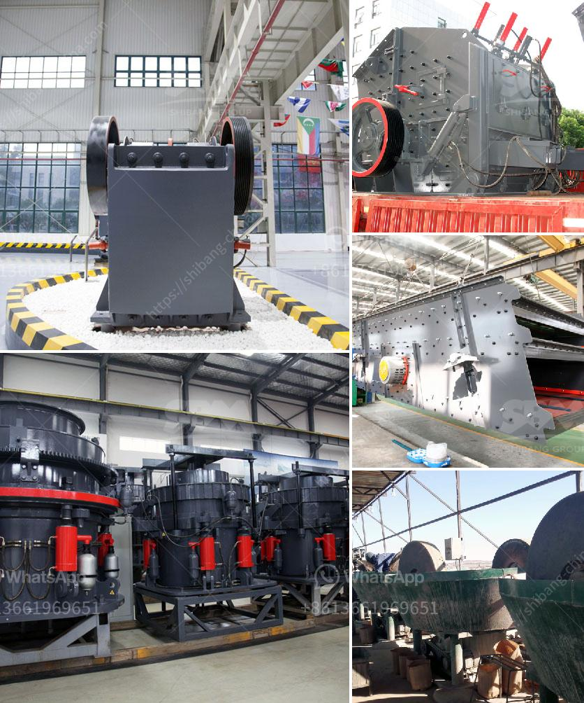

<h3>bell finlay crusher prices</h3>
When it comes to crushing and screening equipment, Bell Finlay crushers have earned a solid reputation for their reliability, performance, and durability. Whether you are in the construction, mining, or quarrying industry, investing in a quality crusher is crucial to optimize productivity and reduce operating costs. In this article, we will explore the various factors that influence Bell Finlay crusher prices, empowering buyers to make informed decisions.

The first factor that affects the price of a Bell Finlay crusher is the model and specifications. Different models, such as J-1170, C-1540, and I-120RS, come with varying capabilities and features. Crushers with advanced technologies and high production capacities are usually priced higher.

The intended workload determines the size and power of the crusher required. Higher production capacity crushers can handle larger volumes of materials and are generally priced higher compared to those with lower capacities.

Bell Finlay offers a range of additional features and optional extras to enhance the performance and adaptability of their crushers. These features can include remote-control operation, advanced hydraulic systems, and integrated dust suppression. The more features a crusher has, the higher the price is likely to be.

Consider the costs associated with maintenance and service contracts. Some Bell Finlay crushers come with extended warranty options and service packages that can help reduce downtime and keep the equipment in optimal condition. These additional services may affect the overall price of the crusher.

Market conditions and geographical location can also impact Bell Finlay crusher prices. Factors such as local demand, taxes, import duties, and transportation costs may cause price variations in different regions.

Before purchasing a Bell Finlay crusher, it is essential to assess your specific requirements and budget. Comparing prices from different suppliers and seeking quotes can help you find the best deal. Additionally, conducting research on the reputation and customer reviews of different suppliers can ensure that you choose a reliable and reputable seller.

In conclusion, Bell Finlay crushers are known for their quality and performance in various industries. Understanding the factors that influence their prices allows buyers to make informed decisions and select the crusher that best suits their needs and budget. By considering model and specifications, production capacity, additional features, maintenance and service contracts, and market conditions, buyers can confidently invest in a Bell Finlay crusher that will deliver excellent value for their money.
<h3>Contact us</h3><ul><li><strong>Whatsapp:&nbsp;<a href="https://wa.me/8613661969651">+8613661969651</a></strong></li><li><a href="https://swt.shibang-china.com/?git&amp;zhl&amp;bell finlay crusher prices"><strong>Online Service(chat now)</strong></a></li></ul><h3>Related</h3><ul><li><a href='safety sings for crusher plant and quarry.md'>safety sings for crusher plant and quarry</a></li><li><a href='iron ore beneficiation process price.md'>iron ore beneficiation process price</a></li><li><a href='feldspar crusher manufacturer.md'>feldspar crusher manufacturer</a></li><li><a href='milling grinding machines manufacturer europe.md'>milling grinding machines manufacturer europe</a></li><li><a href='crushing and screening simulation software.md'>crushing and screening simulation software</a></li></ul>