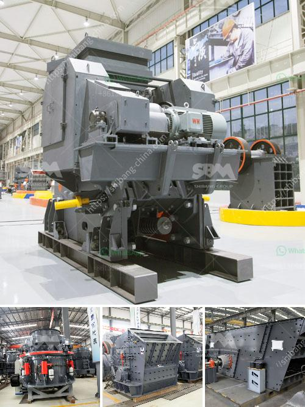

<h3>belt and conveyor distributor in indonesia</h3>
Indonesia, as one of the largest archipelago nations in the world, has been experiencing rapid industrial growth in recent years. The government's focus on developing various sectors, such as manufacturing, mining, and agriculture, has led to an increasing demand for efficient transportation systems. This demand has propelled the growth of the belt and conveyor industry in the country.

Belt and conveyor systems play a crucial role in the transportation of goods within industries. They are widely used in sectors like mining, manufacturing, logistics, and food processing. The ability to move materials efficiently and safely has become a critical factor in improving productivity and reducing overall costs for businesses.

To meet the growing demand for belt and conveyor systems, distributors in Indonesia have stepped up to provide high-quality products and solutions. These distributors play a vital role in the supply chain by sourcing products from manufacturers and ensuring they reach end-users across the country.

One of the key advantages of working with a belt and conveyor distributor is the access to a wide range of products. Distributors typically offer different types of belts, including flat belts, modular belts, and timing belts, to cater to various industries' specific needs. They also provide customizable conveyor systems that can be tailored to meet unique requirements, ensuring optimal performance and flexibility.

Reliable distributors not only offer a diverse product portfolio but also prioritize quality. They collaborate with reputable manufacturers and ensure that the belts and conveyor systems they supply meet international standards. This focus on quality helps to enhance the longevity and durability of these systems, minimizing downtime and maintenance costs for businesses.

Furthermore, a local distributor's proximity ensures faster delivery time and prompt customer service. This is especially important in industries where immediate assistance is crucial, such as mining and manufacturing. Distributors with a wide network and strategic partnerships can efficiently distribute and install conveyor systems across different regions of the country, ensuring smooth operations for industries nationwide.

In addition to providing products, belt and conveyor distributors in Indonesia also offer maintenance and repair services. They understand the importance of keeping operations running smoothly and efficiently. Regular maintenance and proper repair work not only minimize downtime but also extend the lifespan of the conveyor systems, ensuring businesses get the best return on their investment.

The belt and conveyor industry in Indonesia is expected to continue its growth trajectory in the coming years. As the industrial sector expands, the demand for efficient transportation systems will only increase. Belt and conveyor distributors will play a pivotal role in meeting this demand by offering superior products, exceptional customer service, and reliable after-sales support.

In conclusion, the rise of Indonesia's industrial sector has fueled the demand for efficient transportation systems, leading to the growth of the belt and conveyor industry. Distributors in the country are well-positioned to meet this demand by providing a diverse range of high-quality products and solutions, along with maintenance and repair services. Their commitment to excellence ensures that industries across Indonesia can rely on these vital systems for their operations, contributing to the nation's overall economic growth.
<h3>Contact us</h3><ul><li><strong>Whatsapp:&nbsp;<a href="https://wa.me/8613661969651">+8613661969651</a></strong></li><li><a href="https://swt.shibang-china.com/?git&amp;zhl&amp;belt and conveyor distributor in indonesia"><strong>Online Service(chat now)</strong></a></li></ul><h3>Related</h3><ul><li><a href='limestone powder mill in bankura.md'>limestone powder mill in bankura</a></li><li><a href='conveyor belting manufacturers.md'>conveyor belting manufacturers</a></li><li><a href='quote for vsi crusher.md'>quote for vsi crusher</a></li><li><a href='mtm 160 mill spare parts suppliers in india.md'>mtm 160 mill spare parts suppliers in india</a></li><li><a href='coal handling plant maintenance pdf.md'>coal handling plant maintenance pdf</a></li></ul>