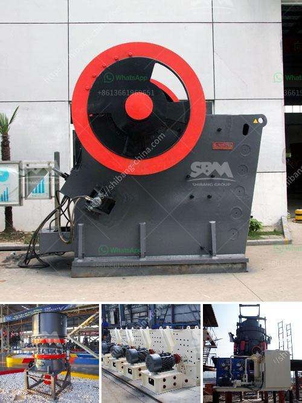

<h3>belt conveyor continental di indonesia</h3>
The belt conveyor system is an integral part of any modern industrial processing facility. It is a versatile and efficient method of transporting goods and materials across various stages of production. One name that stands out in the field of belt conveyor systems is Continental, a global leader in conveyor belt manufacturing and technology. With a strong presence in Indonesia, Continental offers top-notch conveyor systems that cater to the diverse needs of industries in the country.

Continental's belt conveyor systems are renowned for their high reliability, robust design, and optimum performance. Their products are used in a wide range of industries such as mining, manufacturing, agriculture, and more. The company offers a comprehensive portfolio of conveyor belts, each tailored to specific applications and materials. From general-purpose belts to heavy-duty belts for handling large volumes of materials, Continental has a solution for every requirement.

One of the key advantages of Continental's belt conveyor systems is their exceptional durability. The company's conveyor belts are made from high-quality materials that can withstand the most demanding operational conditions. They are designed to resist wear, tear, and abrasion, ensuring a longer lifespan and reduced maintenance costs. Additionally, Continental's belts are resistant to oil, chemicals, and UV rays, making them ideal for use in harsh environments.

Safety is another paramount consideration when it comes to belt conveyor systems. Continental prioritizes the wellbeing of operators and employees by incorporating innovative safety features into their products. Their conveyor belts are equipped with advanced sensors and monitoring systems that detect potential faults or malfunctions, allowing for prompt preventive action. Furthermore, Continental provides comprehensive training and support programs to ensure proper installation, operation, and maintenance of their conveyor systems.

Continental's commitment to sustainability sets them apart from their competitors. The company aims to minimize its environmental impact through the use of energy-efficient manufacturing processes and eco-friendly materials. Their conveyor belts are designed to reduce energy consumption and minimize noise pollution, contributing to a greener and more sustainable future.

In Indonesia, Continental's belt conveyor systems have gained widespread popularity, thanks to their excellent performance and reliability. Industries such as mining, cement, and food processing rely on Continental's conveyor belts to streamline their operations and improve productivity. Whether it's transporting bulk materials, handling heavy loads, or facilitating efficient material sorting, Continental's belt conveyor systems have proven to be a reliable and cost-effective solution.

In conclusion, Continental's belt conveyor systems offer an ideal transportation solution for industries in Indonesia. With their superior durability, safety features, and commitment to sustainability, Continental has earned a solid reputation as a trusted provider of conveyor technology. By choosing Continental, businesses in Indonesia can optimize their operations, enhance productivity, and contribute to a greener future. So, whether you are a small business or a large-scale industrial plant, consider Continental's belt conveyor systems for a seamless and efficient material handling experience.
<h3>Contact us</h3><ul><li><strong>Whatsapp:&nbsp;<a href="https://wa.me/8613661969651">+8613661969651</a></strong></li><li><a href="https://swt.shibang-china.com/?git&amp;zhl&amp;belt conveyor continental di indonesia"><strong>Online Service(chat now)</strong></a></li></ul><h3>Related</h3><ul><li><a href='basalt production equipment.md'>basalt production equipment</a></li><li><a href='granite and marble mining in uganda.md'>granite and marble mining in uganda</a></li><li><a href='china mobile stone crusher machine.md'>china mobile stone crusher machine</a></li><li><a href='i need a second hand mobile stone crusher south africa.md'>i need a second hand mobile stone crusher south africa</a></li><li><a href='rock miller machine.md'>rock miller machine</a></li></ul>