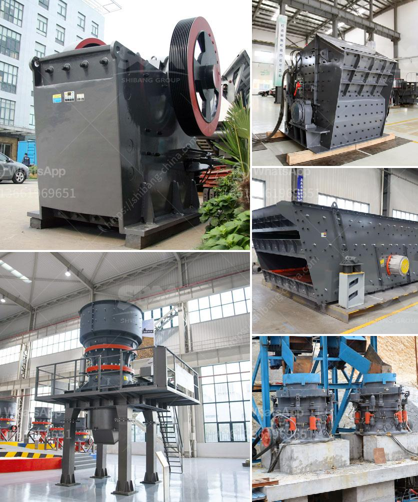

<h3>belt conveyor indonesia</h3>
Belt Conveyor Indonesia is a company that provides belt conveyor systems and maintenance services in Indonesia. The company offers a variety of thorough conveyor maintenance services, including belt splicing, hot and cold vulcanization, pulley lagging installation, and conveyor repair.

With their extensive experience in the industry, Belt Conveyor Indonesia prides itself on delivering high-quality conveyor systems and services to its clients. The company understands the importance of a reliable and efficient conveyor system in industries such as mining, manufacturing, and logistics.

One of the key advantages of working with Belt Conveyor Indonesia is their commitment to providing customized solutions. The company understands that every industry has unique conveyor requirements, and they work closely with their clients to design and implement conveyor systems that meet their specific needs. This tailored approach ensures that clients' operations run smoothly, leading to increased productivity and reduced downtime.

Belt Conveyor Indonesia also offers comprehensive maintenance services to ensure the longevity and optimal performance of conveyor systems. Regular maintenance is crucial to identify and address potential issues before they escalate into costly problems. The company's team of skilled technicians performs routine inspections, belt replacements, and repairs, ensuring that clients' conveyor systems remain in top shape.

In addition to their exceptional products and services, Belt Conveyor Indonesia is committed to providing efficient and timely customer support. Their dedicated customer service team is available to address inquiries, provide technical assistance, and resolve any issues that may arise promptly.

In conclusion, Belt Conveyor Indonesia is a reliable and trusted company that specializes in providing high-quality belt conveyor systems and maintenance services. With their expertise, dedication to customization, and commitment to customer support, they have established themselves as a leading provider in the industry.
<h3>Contact us</h3><ul><li><strong>Whatsapp:&nbsp;<a href="https://wa.me/8613661969651">+8613661969651</a></strong></li><li><a href="https://swt.shibang-china.com/?git&amp;zhl&amp;belt conveyor indonesia"><strong>Online Service(chat now)</strong></a></li></ul><h3>Related</h3><ul><li><a href='quarry equipment leasing companies in nigeria.md'>quarry equipment leasing companies in nigeria</a></li><li><a href='rock drills for sale in south africa.md'>rock drills for sale in south africa</a></li><li><a href='rock quarry plant.md'>rock quarry plant</a></li><li><a href='hammer mill in malaysia.md'>hammer mill in malaysia</a></li><li><a href='general layout of cement plant.md'>general layout of cement plant</a></li></ul>