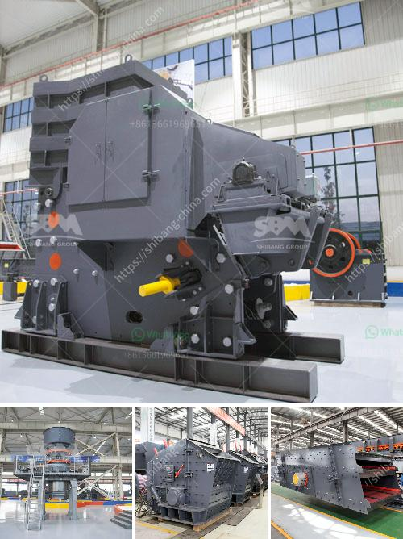

<h3>beneficiation process of clay</h3>
The beneficiation process of clay is a complex and intricate process that involves several steps in order to purify the clay and achieve optimal results. Clay is commonly used in various industries, including ceramics, paper making, and construction. However, before it can be used in these applications, it needs to undergo a beneficiation process to remove impurities and enhance its properties.

One of the first steps in the beneficiation process is the removal of impurities such as rocks, sticks, and other foreign materials. This is done through a process called screening, where the clay is passed through a series of screens to separate the impurities from the clay.

After the initial screening, the clay is washed to further remove any remaining impurities. This is typically done in large tanks where water is added to the clay to help loosen and separate the impurities. The clay is then allowed to settle, and the water is drained off, leaving behind a cleaner clay.

Once the clay has been thoroughly washed, it is then dried to remove any excess moisture. The drying process is usually achieved through the use of large drying ovens or kilns. This step is crucial as excess moisture can adversely affect the properties of the clay and its performance in various applications.

After drying, the clay is often subjected to further processing depending on its intended use. For example, if the clay is to be used in ceramics, it may undergo additional grinding and refining to achieve the desired particle size and consistency.

The beneficiation process of clay is essential in order to produce clay of high quality that meets the specific requirements of various industries. By removing impurities and enhancing its properties, the clay becomes more versatile and suitable for a wide range of applications. Additionally, the beneficiation process ensures that the clay is free from any contaminants that could affect its performance or cause undesirable results.

In conclusion, the beneficiation process of clay is a crucial step in the production of high-quality clay. Through a series of steps such as screening, washing, drying, and refining, impurities are removed, and the clay's properties are enhanced. This process ultimately ensures that the clay is suitable for its intended use and meets the specific requirements of various industries.
<h3>Contact us</h3><ul><li><strong>Whatsapp:&nbsp;<a href="https://wa.me/8613661969651">+8613661969651</a></strong></li><li><a href="https://swt.shibang-china.com/?git&amp;zhl&amp;beneficiation process of clay"><strong>Online Service(chat now)</strong></a></li></ul><h3>Related</h3><ul><li><a href='iron ore beneficiation process price.md'>iron ore beneficiation process price</a></li><li><a href='250 tons per hour crushers.md'>250 tons per hour crushers</a></li><li><a href='crusher concrete kuwait.md'>crusher concrete kuwait</a></li><li><a href='gold crushing machine price in usa.md'>gold crushing machine price in usa</a></li><li><a href='machine of ultra fine mills.md'>machine of ultra fine mills</a></li></ul>